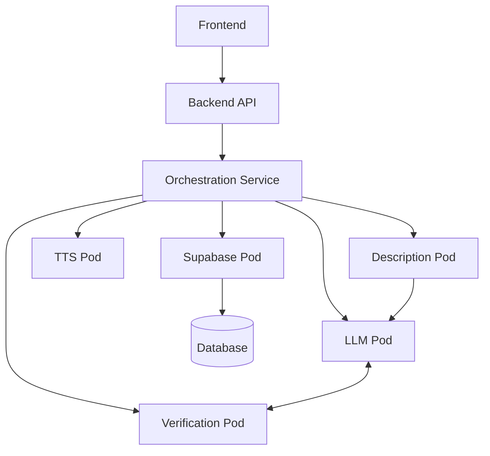

# Tour Guide App Documentation

Welcome to the Tour Guide App documentation. This documentation is organized into logical sections to help you find the information you need.

## Documentation Structure

### [Architecture](./architecture/)
Documentation related to system design and architecture.
- [System Overview](./architecture/system-overview.md)
- [Integration Architecture](./architecture/integration-architecture.md)
- [Containerization Strategy](./architecture/containerization-strategy.md)

### [Development](./development/)
Documentation related to development process and roadmap.
- [Development Roadmap](./development/development-roadmap.md)
- [MVP Specifications](./development/mvp-specs/)
- [Phase Plans](./development/phase-plans/)

### [Features](./features/)
Documentation for key features and functionality.
- [Tour Generation](./features/tour-generation/)
- [Content Creation](./features/content-creation/)
  - [Conversational Enhancement](./features/content-creation/conversational-enhancement.md)
  - [Narrative Description](./features/content-creation/narrative-description.md)
- [Persistence](./features/persistence/)

### [Operations](./operations/)
Documentation for deployment, operations, and maintenance.
- [Container Management](./operations/container-management.md)

### [Technical Notes](./technical-notes/)
Technical notes, fixes, and implementation details.
- [API Path Fix](./technical-notes/api-path-fix.md)
- [Network Connectivity Fixes](./technical-notes/network-connectivity-fixes.md)

## Quick Start

### For Developers
1. Clone the repository: `git clone https://github.com/your-org/tour-guide-app.git`
2. Set up environment variables: `cp .env.example .env` and edit `.env`
3. Start development services: `./run-dev.sh`
4. Access the frontend at http://localhost:3000

### For Operators
1. Review [Container Management](./operations/container-management.md)
2. Deploy with `cd deployment/scripts && ./deploy.sh`
3. Monitor logs with `docker logs <container_name>`

## System Architecture

## Recent Updates

- **3/30/2025**: Enhanced narrative quality with conversational descriptions ✅
- **3/30/2025**: Implemented position-aware tour structure (welcome, transitions, conclusion) ✅
- **3/30/2025**: Fixed TTS compatibility with narrative text ✅
- **3/30/2025**: Reorganized documentation for better accessibility ✅
- **3/29/2025**: Implemented end-to-end integration between all components ✅
- **3/25/2025**: Added country data handling throughout the application ✅

## Tech Stack

- **Frontend**: Next.js, TypeScript, Leaflet
- **Backend**: Node.js, Express, TypeScript
- **Containers**: Docker/Podman
- **AI**: OpenAI/Claude LLMs
- **TTS**: Kokoro TTS, espeak-ng
- **Database**: Supabase (PostgreSQL)
