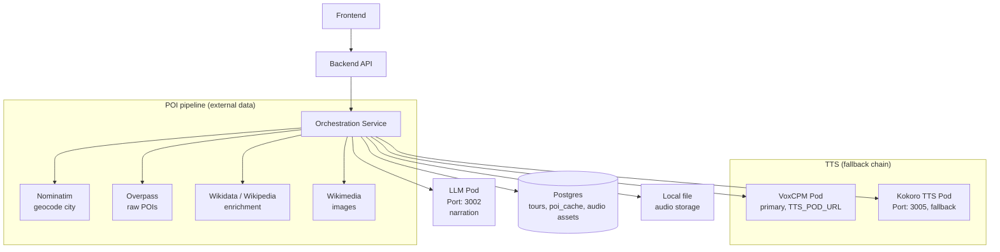

# Architecture Documentation

This directory contains documentation about the system architecture and design of the Tour Guide App.

## Contents

- [Integration Architecture](./integration-architecture.md) - How components communicate
- [Containerization Strategy](./containerization-strategy.md) - Container setup for development and production

### POI / Tour selection & composition

- [Tour Quality — Landmark Tiering, Set Construction & Composition](./tour-quality-landmark-tiering.md) - **Current design brief.** Why tours feel non-product-credible, and the partial redesign (fame-based landmark tiering, set construction, soft walkability). Supersedes parts of the rework plan below.
- [Tour Quality — Fixtures & Acceptance Oracle](./tour-quality-fixtures-acceptance.md) - **Next-steps brief.** Deterministic offline regression suite for tour quality (frozen pools + per-city anchor oracle) so heuristics can be tuned without live runs.
- [POI Selection Rework Plan](./poi-selection-rework-plan.md) - Prior plan for stabilizing the selection/composition pipeline (partially superseded).
- [Tour Selection](./tour-selection.md) - Current selection overview.
- [Narration Pipeline](./narration-pipeline.md) - How narration is generated for final stops.

## Architecture Diagram

Reflects the **active OSM tour pipeline** (`OrchestrationService.generateCompleteTour` →
`generatePlacesFromOsm`). The legacy LLM-place-generation / verification / description path is
no longer on the active route — see note below.

### Legacy / inactive path

These pods still exist in `pods/` but are **not called** by the active OSM pipeline:

- **Verification Pod** (`verification-pod`, port 3003) — used only by the orphaned
  `verifyPlaces` method.
- **Description Pod** (`description-pod`, port 3004) — used only by the orphaned
  `generateDescriptions` method.
- **LLM `/generate/places`** — the orphaned `generateInitialPlaces` method (the active path
  sources POIs from Overpass, not the LLM).

The `supabase-pod` is also retained; the active path persists via `PostgresTourRepository` /
`PostgresAudioAssetRepository` and `LocalFileAudioStorage`.

## Key Design Decisions

- Microservices architecture with specialized pods (narration, TTS); POI data sourced
  directly from open APIs (Overpass, Wikidata/Wikipedia, Wikimedia, Nominatim).
- RESTful communication between services.
- Containerization for consistent development and deployment.
- Postgres-backed persistence with local filesystem audio storage; `poi_cache` keyed by
  `(city, theme)`.
- TTS uses a primary/fallback chain (VoxCPM → Kokoro).
