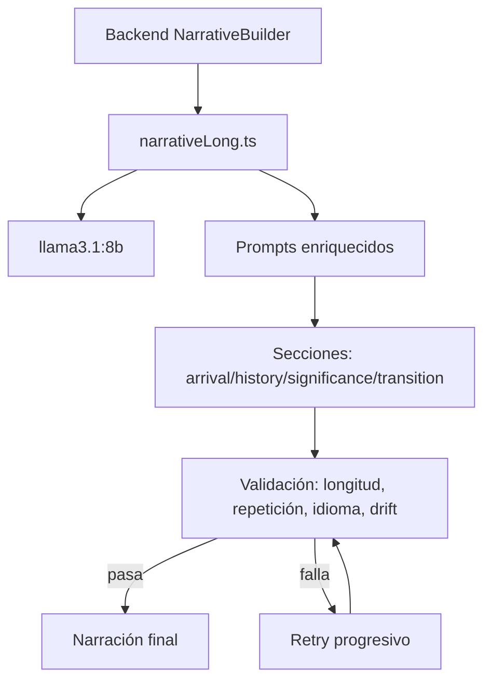

# Pipeline de narración: modelo y calidad del tour

> Documento de planificación. No cambia comportamiento de producción hasta que se implemente en código.

## Estado actual

- La ruta larga de narración está en `pods/llm-pod/src/routes/narrativeLong.ts`.
- Actualmente `NARRATIVE_MODEL = 'qwen3:4b'` está hardcodeado para narración larga.
- El modelo por defecto del llm-pod por entorno es `gemma4:26b`, pero no es el modelo activo para narración larga porque la ruta sobrescribe el modelo.
- El usuario ya descargó `llama3.1:8b`; debe documentarse como modelo disponible y recomendado para narración frente a `qwen3:4b`.

```mermaid
flowchart LR
  B[Backend NarrativeBuilder] --> L[/narrative/stop/long]
  L --> M[qwen3:4b hardcodeado]
  L --> P[Prompts por sección]
  P --> A[arrival]
  P --> H[history]
  P --> S[significance]
  P --> T[transition]
  A --> J[Texto final unido]
  H --> J
  S --> J
  T --> J
```

## Estado objetivo

- Usar `llama3.1:8b` como modelo recomendado para narración larga.
- Mantener prompts por sección, pero enriquecerlos para producir una experiencia de guía local, no texto turístico genérico.
- Añadir una política de retry más útil para secciones débiles.



## Roadmap de implementación

### Fase N-1 — Cambiar modelo de narración larga a `llama3.1:8b`

Archivo futuro: `pods/llm-pod/src/routes/narrativeLong.ts`.

Cambio previsto:
- Cambiar `NARRATIVE_MODEL` de `qwen3:4b` a `llama3.1:8b`.
- Documentar que `gemma4:26b` puede seguir siendo el default env del pod, pero no gobierna esta ruta mientras exista override local.

Por qué importa / riesgo reducido:
- `llama3.1:8b` ofrece más capacidad narrativa que `qwen3:4b` con un coste de VRAM razonable.
- Evita asumir erróneamente que `gemma4:26b` está activo en la ruta larga.

Criterios de aceptación:
- Logs o trazas muestran `llama3.1:8b` en `/narrative/stop/long`.
- La generación larga sigue pasando validaciones existentes.
- Se puede revertir a `qwen3:4b` con un cambio puntual si hay regresiones.

### Fase N-2 — Retry progresivo de calidad

Archivo futuro: `pods/llm-pod/src/routes/narrativeLong.ts`.

Política prevista:
1. Intento normal con instrucciones completas.
2. Retry con temperatura más baja y mensaje explícito sobre el fallo de calidad.
3. Retry simplificado, factual y corto antes de usar fallback.

Por qué importa / riesgo reducido:
- Reduce narraciones genéricas o secciones de plantilla sin multiplicar la complejidad.
- Mantiene los fallbacks actuales como última red de seguridad.

Criterios de aceptación:
- Menos secciones caen a fallback genérico en POIs con datos pobres.
- El tiempo total de generación no supera 2x el baseline salvo casos de retry.

### Fase N-3 — Mejoras de prompts por sección

Archivos futuros:
- `pods/llm-pod/src/prompts/narrative/types.ts`
- `pods/llm-pod/src/prompts/narrative/arrival.ts`
- `pods/llm-pod/src/prompts/narrative/history.ts`
- `pods/llm-pod/src/prompts/narrative/significance.ts`
- `pods/llm-pod/src/prompts/narrative/transition.ts`

Cambios previstos:
- Persona de guía local cálida y experta.
- Detalles sensoriales y orientación visual al llegar.
- Historia narrada con gancho, no listado de fechas.
- Conexión clara con el tema del tour: “por qué importa aquí y ahora”.
- Transiciones con callbacks entre paradas cuando sea posible.

Por qué importa / riesgo reducido:
- Mejora la calidad percibida sin cambiar contratos de API ni persistencia.
- Reduce el riesgo de una gran reescritura multiagente o multipass prematura.

Criterios de aceptación:
- Revisión manual de al menos 3 tours en idiomas distintos.
- La narración suena como guía humano, usa hechos concretos y fluye entre secciones.
- No aumenta la alucinación factual según las validaciones actuales.
