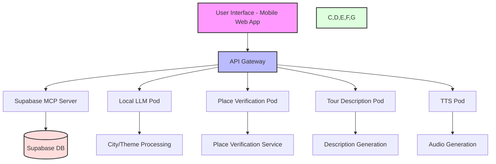

# Tour Guide Application Documentation

## Table of Contents
1. [System Overview](#system-overview)
2. [Architecture](#architecture)
3. [Technical Stack](#technical-stack)
4. [Development Roadmap](#development-roadmap)
5. [Implementation Details](#implementation-details)
6. [Deployment Guide](#deployment-guide)
7. [Maintenance](#maintenance)

## System Overview

The Tour Guide Application is a mobile-first web platform that generates personalized city tours using AI. It combines local Large Language Models (LLM) for content generation, place verification, and text-to-speech capabilities to create immersive audio tours.

### Key Features
- City-based tour generation
- Theme-specific routes (architecture, history, food, etc.)
- Real-world place verification
- AI-generated tour descriptions
- Local text-to-speech audio generation
- Mobile-optimized interface
- Offline capabilities



## Architecture

### Pod Structure

#### 1. API Gateway Pod
- **Purpose**: Central routing and communication hub
- **Responsibilities**:
  - Request/response handling
  - Authentication and authorization
  - Rate limiting
  - Load balancing
  - Error handling
  - Request logging
- **Configuration**:
  ```yaml
  name: api-gateway
  port: 3000
  rate_limit: 100/minute
  timeout: 30s
  ```

#### 2. Local LLM Pod
- **Purpose**: AI-powered place and content generation
- **Components**:
  - Llama.cpp runtime
  - Prompt management system
  - Context handler
- **Model Configuration**:
  ```yaml
  model: llama-2-7b-q4
  context_length: 4096
  temperature: 0.7
  top_p: 0.9
  ```

#### 3. Place Verification Pod
- **Purpose**: Validate real-world existence of generated places
- **Services**:
  - OpenStreetMap API integration
  - Geocoding service
  - Place metadata validation
- **Caching**:
  ```yaml
  cache_type: local
  cache_size: 1GB
  ttl: 7d
  ```

#### 4. Tour Description Pod
- **Purpose**: Generate detailed tour descriptions
- **Features**:
  - Historical context integration
  - Architectural details
  - Cultural significance
  - Visitor recommendations
- **Output Format**:
  ```yaml
  format: markdown
  max_length: 2000
  sections:
    - history
    - architecture
    - cultural_significance
    - practical_info
  ```

#### 5. TTS Pod
- **Purpose**: Convert tour descriptions to audio
- **Engine**: Coqui TTS
- **Configuration**:
  ```yaml
  model: your_tts
  language: en
  speaker_embeddings: true
  audio_format: mp3
  sample_rate: 22050
  ```

### Supabase Integration

#### Database Schema
```sql
-- Places
CREATE TABLE places (
  id UUID PRIMARY KEY,
  name VARCHAR(255),
  city VARCHAR(100),
  theme VARCHAR(50),
  coordinates POINT,
  verified BOOLEAN,
  created_at TIMESTAMPTZ,
  updated_at TIMESTAMPTZ
);

-- Descriptions
CREATE TABLE descriptions (
  id UUID PRIMARY KEY,
  place_id UUID REFERENCES places(id),
  content TEXT,
  language VARCHAR(10),
  version INT,
  created_at TIMESTAMPTZ
);

-- Audio Files
CREATE TABLE audio_files (
  id UUID PRIMARY KEY,
  description_id UUID REFERENCES descriptions(id),
  file_path VARCHAR(255),
  duration INT,
  format VARCHAR(10),
  created_at TIMESTAMPTZ
);

-- Tours
CREATE TABLE tours (
  id UUID PRIMARY KEY,
  city VARCHAR(100),
  theme VARCHAR(50),
  places UUID[],
  created_at TIMESTAMPTZ
);
```

## Technical Stack

### Frontend
- **Framework**: Next.js 14+
  - Server components
  - App router
  - API routes

- **Styling**:
  ```yaml
  framework: Tailwind CSS
  plugins:
    - @tailwindcss/forms
    - @tailwindcss/typography
  customization:
    - Custom color palette
    - Responsive breakpoints
    - Dark mode support
  ```

- **State Management**:
  - React Query
  - Zustand

- **PWA Features**:
  - Offline support
  - Push notifications
  - App manifest
  - Service workers

### Backend
- **Runtime**: Node.js 20+
- **API Framework**: Express.js
- **Pod Management**: systemd-nspawn
- **Database**: Supabase

### AI/ML Components
- **LLM**: Llama.cpp
  - Model: Llama-2-7B-Q4
  - Optimization: GGML format
  
- **TTS**: Coqui TTS
  - Model: YourTTS
  - Language support: Multi-language

- **Place Verification**:
  - OpenStreetMap API
  - Nominatim geocoding

### Development Environment
- **WSL (Windows Subsystem for Linux)**:
  - Linux-native development environment
  - Enhanced performance for Node.js and npm
  - Native Docker support for pod management
  - Improved filesystem performance
  - Better development-production parity
  ```yaml
  environment: WSL2
  filesystem: Linux
  networking: Native WSL
  container_support: Docker + systemd-nspawn
  performance_benefits:
    - Fast file I/O
    - Native Linux tooling
    - Container orchestration
  ```

### Project Structure
```
tour-guide-app/
├── docs/                  # Documentation and specifications
│   ├── tour-guide-app.md
│   ├── api-spec.md
│   └── deployment.md
│
├── frontend/             # Next.js web application
│   ├── src/
│   │   ├── app/         # Next.js app directory
│   │   ├── components/  # React components
│   │   │   ├── common/  # Shared components
│   │   │   ├── tour/   # Tour-related components
│   │   │   ├── places/ # Place-related components
│   │   │   └── audio/  # Audio player components
│   │   ├── hooks/      # Custom React hooks
│   │   ├── services/   # API integration services
│   │   ├── types/      # TypeScript type definitions
│   │   └── utils/      # Utility functions
│   ├── public/         # Static assets
│   │   ├── assets/
│   │   └── icons/
│   ├── styles/         # Global styles and themes
│   └── tests/         # Frontend test suite
│
├── backend/             # Express.js API server
│   ├── api/            # API endpoints
│   │   ├── routes/
│   │   └── controllers/
│   ├── middleware/     # Express middleware
│   ├── services/       # Business logic services
│   │   ├── tour/
│   │   ├── place/
│   │   └── audio/
│   ├── utils/         # Helper utilities
│   └── tests/         # Backend test suite
│
├── pods/               # AI service containers
│   ├── llm-pod/       # LLM service
│   │   ├── src/
│   │   ├── models/
│   │   └── config/
│   ├── verification-pod/  # Place verification
│   │   ├── src/
│   │   └── config/
│   ├── description-pod/   # Tour descriptions
│   │   ├── src/
│   │   └── config/
│   └── tts-pod/          # Text-to-speech
│       ├── src/
│       ├── models/
│       └── config/
│
└── scripts/            # Development and deployment scripts
    ├── setup/         # Environment setup
    │   ├── init-pods.sh
    │   └── setup-env.sh
    ├── deployment/    # Deployment utilities
    └── monitoring/    # Monitoring tools
```

## Development Roadmap

### Phase 1: Infrastructure Setup (Weeks 1-2)
1. **Project Initialization**
   ```bash
   mkdir tour-guide-app
   cd tour-guide-app
   npm init -y
   git init
   ```

2. **Supabase Setup**
   - Create project
   - Configure authentication
   - Initialize database schema
   - Set up MCP server

3. **Pod Environment**
   - Install systemd-nspawn
   - Configure pod networking
   - Set up pod communication

### Phase 2: Core Features (Weeks 3-5)
1. **LLM Integration**
   - Model deployment
   - Prompt engineering
   - Response processing

2. **Place Generation**
   - City data integration
   - Theme-based filtering
   - Output formatting

3. **Verification System**
   - API integration
   - Validation logic
   - Error handling

### Phase 3: Audio System (Weeks 6-7)
1. **TTS Implementation**
   - Model setup
   - Voice configuration
   - Audio processing

2. **Audio Management**
   - Storage system
   - Caching strategy
   - Delivery optimization

### Phase 4: Frontend (Weeks 8-10)
1. **UI Development**
   - Component library
   - Responsive design
   - Accessibility

2. **PWA Features**
   - Offline support
   - Installation flow
   - Update mechanism

## Implementation Details

### API Endpoints
```typescript
// Base URL: /api/v1

// Tours
POST   /tours/generate      // Generate new tour
GET    /tours/:id          // Get tour details
PUT    /tours/:id          // Update tour
DELETE /tours/:id          // Delete tour

// Places
GET    /places/:id         // Get place details
POST   /places/verify      // Verify place exists

// Audio
GET    /audio/:id          // Get audio file
POST   /audio/generate     // Generate new audio
```

### Error Handling
```typescript
interface ErrorResponse {
  error: {
    code: string;
    message: string;
    details?: any;
  };
  status: number;
}
```

### Performance Optimizations
1. **Caching Strategy**
   - Redis for API responses
   - Service Worker for static assets
   - IndexedDB for offline data

2. **Load Balancing**
   - Pod-level distribution
   - Request queuing
   - Rate limiting

## Deployment Guide

### Prerequisites
- Node.js 20+
- systemd-nspawn
- Supabase account
- OpenStreetMap API key

### Pod Deployment
1. **Create Pod**
   ```bash
   # Create pod directory
   sudo mkdir -p /var/lib/machines/pod-name
   
   # Bootstrap system
   sudo debootstrap --arch=amd64 focal /var/lib/machines/pod-name
   
   # Configure networking
   sudo systemd-nspawn --machine=pod-name --network-veth
   ```

2. **Start Services**
   ```bash
   # Start all pods
   sudo machinectl start pod-name
   
   # Check status
   sudo machinectl status pod-name
   ```

### Monitoring
- Pod health checks
- Resource usage
- Error tracking
- Performance metrics

## Maintenance

### Updates
1. **Model Updates**
   - LLM version control
   - TTS model improvements
   - Verification system updates

2. **Content Management**
   - Description templates
   - Audio quality checks
   - Place data verification

### Backup Strategy
1. **Database**
   - Daily incremental
   - Weekly full backup
   - 30-day retention

2. **Audio Files**
   - Geographic redundancy
   - Versioning system
   - Corruption checks

### Security
1. **Authentication**
   - JWT tokens
   - Rate limiting
   - IP whitelisting

2. **Data Protection**
   - Encryption at rest
   - Secure communication
   - Regular security audits

---

## Contributing
Please review the [CONTRIBUTING.md](./CONTRIBUTING.md) file for guidelines on how to contribute to this project.

## License
This project is licensed under the MIT License - see the [LICENSE.md](./LICENSE.md) file for details.
