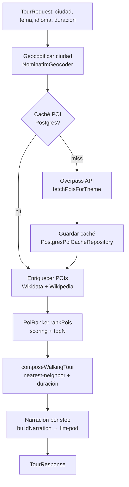

# Pipeline de Selección de POIs

> Estado: Fase N-4 implementada el 2026-05-24 para el tema `history`.

## Objetivo

Documentar el pipeline completo de selección de puntos de interés (POI), desde las etiquetas Overpass hasta la composición de ruta, incluyendo limitaciones conocidas y plan de mejora.

## Flujo actual



### Paso a paso

| Paso | Archivo | Líneas | Descripción |
|------|---------|--------|-------------|
| 1. Geocodificar | `orchestrationService.ts` | 497-507 | Convierte nombre de ciudad a coordenadas vía Nominatim |
| 2. Fetch POIs | `orchestrationService.ts` | 510-517 | `fetchPoisForTheme()` consulta Overpass con etiquetas del tema. Resultado cacheado en `poi_cache` Postgres |
| 3. Enriquecer | `orchestrationService.ts` | 520-571 | `enrichFromWikidata()` + `enrichFromWikidataClaims()` + `enrichFromWikipedia()` por cada POI |
| 4. Ranking | `orchestrationService.ts` | 573-574 | `rankPois()` ordena por score, corta a `topN` según duración |
| 5. Composición | `orchestrationService.ts` | 595 | `composeWalkingTour()` nearest-neighbor + ajuste a duración |
| 6. Narración | `orchestrationService.ts` | 599-632 | `buildNarration()` → llm-pod `/narrative/stop/long` por cada stop |

## Etiquetas de tema: `themeTags.ts`

**Archivo**: `backend/src/domain/poi/themeTags.ts` (59 líneas)

### Tema "history" implementado

```typescript
history: {
  unionFilters: [
    'node["historic"="castle"]',
    'way["historic"="castle"]',
    'relation["historic"="castle"]',
    'node["historic"="palace"]',
    'way["historic"="palace"]',
    'relation["historic"="palace"]',
    'node["historic"="manor"]',
    'way["historic"="manor"]',
    'relation["historic"="manor"]',
    'node["historic"="city_gate"]',
    'way["historic"="city_gate"]',
    'relation["historic"="city_gate"]',
    'node["historic"="citywalls"]',
    'way["historic"="citywalls"]',
    'relation["historic"="citywalls"]',
    'node["building"="cathedral"]',
    'way["building"="cathedral"]',
    'relation["building"="cathedral"]',
    'node["building"="church"]["historic"]',
    'way["building"="church"]["historic"]',
    'relation["building"="church"]["historic"]',
    'node["tourism"="attraction"]["historic"]',
    'way["tourism"="attraction"]["historic"]',
    'relation["tourism"="attraction"]["historic"]',
    'node["historic"]',                                    // cualquier historic=*
    'way["historic"]',
    'relation["historic"]',
    'node["tourism"="museum"]["museum"="history"]',        // museo de historia
    'way["tourism"="museum"]["museum"="history"]',
    'node["building"~"^(cathedral|palace|castle)$"]',      // edificios históricos
    'way["building"~"^(cathedral|palace|castle)$"]',
  ],
}
```

### Problema detectado (live test Madrid, 2026-05-24)

El filtro `historic=*` devuelve **todos** los nodos con etiqueta `historic`, que en el ecosistema OSM incluye predominantemente:
- `historic=monument` (estatuas, memoriales)
- `historic=memorial` (placas conmemorativas)
- `historic=wayside_cross`
- `historic=boundary_stone`

Esto explica por qué un tour de "historia" en Madrid devolvió:
- ✅ Monument à Federico García Lorca (estatua, `historic=monument`)
- ✅ Massacre d'Atocha de 1977 (memorial, `historic=memorial`)
- ✅ Estatua a Miguel de Cervantes (estatua literaria)
- ✅ Monument à ceux qui sont tombés pour l'Espagne (memorial de guerra)
- ✅ Claudio Moyano (estatua de educador del s.XIX, oscura)
- ✅ Kilómetro Cero (el único icónico)

**Faltaron**: Palacio Real, Plaza Mayor, Catedral de la Almudena, Museo del Prado, Templo de Debod, Gran Vía.

**Causa raíz**: Las etiquetas no incluyen `tourism=attraction` (que cubre la mayoría de edificios históricos visitables), ni `historic=palace`, `historic=castle`, ni `building=cathedral` como valor único (solo como regex sobre `building`).

### Comparación con otros temas

| Tema | Enfoque | Calidad en Madrid |
|------|---------|-------------------|
| `history` | `historic=*` genérico + `building~cathedral/palace/castle` | Sesgado a estatuas/memoriales |
| `architecture` | `building~cathedral/palace/castle/church/civic/public` + `tourism=attraction[historic]` + `man_made~tower/lighthouse/bridge` + `architect` | Más rico y variado |
| `art` | `tourism=museum` + `tourism=gallery` + `tourism=artwork` + `historic=monument[wikipedia]` | Bien enfocado |
| `food` | `amenity=marketplace` + `shop~bakery/pastry/cheese/wine/greengrocer` + `tourism=attraction[wikipedia/wikidata]` | Mixto |

**Nota**: El tema `architecture` ya incluye `tourism=attraction[historic]` — el tema `history` debería hacer lo mismo.

## Ranking: `PoiRanker.ts`

**Archivo**: `backend/src/services/poi/PoiRanker.ts` (61 líneas)

### Sistema de scoring implementado

```typescript
function scorePoi(poi, centroidLat, centroidLng): number {
  let score = 0;
  if (poi.tags.wikidata) score += 3;      // tiene ID Wikidata
  if (poi.tags.wikipedia) score += 2;     // tiene artículo Wikipedia
  if (poi.name) score += 1;               // tiene nombre
  if (poi.enriched.description) score += 2; // tiene descripción enriquecida
  if (wikipediaBody.length > 5000) score += 3;
  else if (wikipediaBody.length > 2000) score += 2;
  score += Math.min(relevantWikidataClaims, 3);
  if (historic castle/palace) score += 2;
  if (tourism=attraction) score += 1;
  if (building=cathedral) score += 1;
  if (translations > 0) score += 1;       // tiene traducciones
  score -= Math.min(distKm * 0.5, 5);     // penalización por distancia
  return score;
}
```

### Limitaciones

| Aspecto | Estado actual | Problema |
|---------|---------------|----------|
| Notabilidad | Solo presencia binaria de wikidata/wikipedia | Una estatua oscura con Wikidata puntúa igual que el Palacio Real si ambos tienen Wikidata |
| Pageviews | No se usan | No hay diferenciación entre POIs mundialmente conocidos y POIs locales menores |
| Categoría OSM | No se usa en scoring | Un `historic=monument` (estatua) puntúa igual que un `historic=castle` |
| Relevancia temática | No se usa | Todos los POIs que pasan el filtro Overpass reciben el mismo tratamiento |
| Densidad de datos | Solo presencia de descripción (+2) | No pondera la riqueza del artículo Wikipedia (longitud, secciones) |

### Consecuencia

Un `historic=monument` con Wikidata (una estatua con ficha) puede puntuar **más alto** que un edificio histórico sin artículo Wikipedia propio pero con importancia cultural objetiva. El ranking es puramente binario: "tiene X" vs "no tiene X".

## Plan de mejora

**Estado 2026-05-24**: Fase N-4 completada y reforzada tras postmortem Madrid.
- `themeTags.ts`: el tema `history` usa grupos priorizados para edificios/heritage, atracciones/museos notables y `historic=*` sólo con Wikidata/Wikipedia. Se evita el catch-all desnudo que llenaba Overpass con memoriales/boundary stones.
- `OverpassPoiFetcher.ts`: para temas con `priorityGroups`, ejecuta consultas secuenciales, deduplica, filtra POIs de bajo valor (`aircraft`, rides, sin nombre) y limita el pool priorizado a 150 POIs.
- `PoiRanker.ts`: añadido peso de notabilidad por longitud de artículo Wikipedia, claims relevantes y categorías OSM. Se refuerza la preferencia por palacios/catedrales/atracciones/museos/heritage y se penalizan memoriales/artwork/aircraft.
- `PostgresPoiCacheRepository.ts`: TTL en development reducido a 1h para no congelar pools malos durante iteración; production conserva 30 días.
- `orchestrationService.ts`: añadido logging conciso de POIs seleccionados y una muestra de POIs rechazados bajo el corte `topN`.
- Validación adicional 2026-05-24: `npm run build` pasó; el cache Madrid/history fue purgado; un fetch fresco devolvió 150 POIs priorizados con Palacio Real, Palacio Real de Madrid, Catedral de la Almudena, Puerta de Alcalá, Puerta del Sol, Plaza Mayor y Museo de Historia de Madrid presentes. Un ranking local simplificado puso landmarks/edificios por encima de estatuas.
- Limitación: no se ejecutó un tour completo con narración+audio tras el fix por coste runtime; se validó pool y ranking localmente.

Actualización 2026-05-29:
- Ya se ejecutó una corrida runtime de `Madrid/history/es/240`.
- El resultado confirmó que el pool y el shortlist mejoraron, pero abrió un nuevo cuello de botella: la composición final sigue favoreciendo un clúster muy compacto del centro y puede devolver un tour degradado muy por debajo de la duración solicitada.
- Conclusión revisada: la siguiente prioridad ya no es solo ranking/fetching, sino la estrategia de composición para tours largos en ciudades ricas en landmarks.

### Fase N-4.1 — Expandir etiquetas del tema "history"

**Archivo**: `backend/src/domain/poi/themeTags.ts`

**Cambios propuestos**:

```typescript
history: {
  unionFilters: [
    // Edificios y estructuras históricas (NUEVOS - más específicos que historic=*)
    'node["historic"="castle"]',
    'way["historic"="castle"]',
    'node["historic"="palace"]',
    'way["historic"="palace"]',
    'node["historic"="manor"]',
    'way["historic"="manor"]',
    'node["historic"="city_gate"]',
    'way["historic"="city_gate"]',
    'node["historic"="citywalls"]',
    'way["historic"="citywalls"]',
    
    // Edificios religiosos históricos
    'node["building"="cathedral"]',
    'way["building"="cathedral"]',
    'node["building"="church"]["historic"]',
    'way["building"="church"]["historic"]',
    
    // Atracciones turísticas con valor histórico (NUEVO - cubre Palacio Real, Plaza Mayor, etc.)
    'node["tourism"="attraction"]["historic"]',
    'way["tourism"="attraction"]["historic"]',
    'relation["tourism"="attraction"]["historic"]',
    
    // Mantener museos de historia (existente)
    'node["tourism"="museum"]["museum"="history"]',
    'way["tourism"="museum"]["museum"="history"]',
    
    // Genérico historic=* (existente, pero ahora complementado)
    'node["historic"]',
    'way["historic"]',
    'relation["historic"]',
    
    // Edificios históricos (existente)
    'node["building"~"^(cathedral|palace|castle)$"]',
    'way["building"~"^(cathedral|palace|castle)$"]',
  ],
}
```

**Por qué importa / riesgo reducido**:
- Las etiquetas específicas (`historic=castle`, `historic=palace`, `tourism=attraction[historic]`) se evalúan antes que el genérico `historic=*`, enriqueciendo el pool de candidatos con edificios y atracciones en lugar de solo estatuas.
- No se eliminan etiquetas existentes — es puramente aditivo.
- Overpass devuelve resultados union (OR), así que añadir más filtros solo amplía el pool.

**Criterios de aceptación**:
- Tour "historia" en Madrid devuelve ≥ 3 edificios/atracciones (no solo estatuas).
- Palacio Real, Plaza Mayor, o Catedral de la Almudena aparecen en el pool de candidatos.
- `npm run build` en backend pasa.
- Tours de otros temas no se ven afectados.

### Fase N-4.2 — Añadir peso de notabilidad al PoiRanker

**Archivo**: `backend/src/services/poi/PoiRanker.ts`

**Cambios propuestos**:

1. **Ponderar Wikidata por presencia de claims**: No es lo mismo un item de Wikidata con 5 claims que uno con 50.
   - Usar los claims ya enriquecidos (`wikidataClaims`) para bonus: `+1` por cada claim relevante (inception, architect, heritage, significant event), hasta `+3` máximo.

2. **Ponderar Wikipedia por longitud de artículo**:
   - `wikipediaBody.length > 2000` → `+2` adicional (artículo sustancial)
   - `wikipediaBody.length > 5000` → `+3` adicional (artículo extenso)

3. **Bonus por categoría OSM** (nuevo):
   - `historic=castle`, `historic=palace` → `+2`
   - `tourism=attraction` → `+1`
   - `building=cathedral` → `+1`

4. **Añadir logging de POIs rechazados** (ver Fase N-4.3).

**Por qué importa / riesgo reducido**:
- Diferencia entre un POI "con Wikidata porque existe" y un POI "con Wikidata rico porque es importante".
- Recompensa edificios y atracciones sobre estatuas genéricas.
- Sin cambios de contrato, schema, o pods.

**Criterios de aceptación**:
- POIs icónicos (Palacio Real, Museo del Prado) puntúan más alto que estatuas menores.
- `npm run build` en backend pasa.
- El ranking no rompe para POIs sin Wikipedia (siguen recibiendo score base).

### Fase N-4.3 — Logging de POIs rechazados

**Archivo**: `backend/src/services/orchestrationService.ts`, método `generatePlacesFromOsm()` (línea ~573-595)

**Cambio propuesto**:

Después de `rankPois()`, añadir un log estructurado con:
```typescript
// POIs que entraron al ranking pero no pasaron el corte topN
const rejected = ranked.slice(topN);
if (rejected.length > 0) {
  console.log('[OSM] Rejected POIs (below topN cutoff):', JSON.stringify(
    rejected.map(r => ({
      name: r.name,
      score: r.score,
      hasWikidata: !!r.tags.wikidata,
      hasWikipedia: !!r.tags.wikipedia,
      osmType: r.tags.historic || r.tags.tourism || r.tags.building || 'unknown',
    }))
  ));
}

// POIs del topN que fueron seleccionados
console.log('[OSM] Selected POIs:', JSON.stringify(
  ranked.map(r => ({
    name: r.name,
    score: r.score,
    osmType: r.tags.historic || r.tags.tourism || r.tags.building || 'unknown',
  }))
));
```

**Por qué importa / riesgo reducido**:
- Permite depurar la selección de POIs en producción sin cambiar el comportamiento.
- Hace visible qué POIs fueron rechazados y por qué score.
- Facilita iterar sobre las etiquetas y el scoring con datos reales.

**Criterios de aceptación**:
- Backend logs muestran POIs rechazados con nombre, score y tipo OSM.
- `npm run build` en backend pasa.
- Sin cambios de API o contrato.

## Diagrama de diagnóstico

```
TourRequest "history", Madrid, 240min
│
├─ Overpass: historic=* → 80% estatuas/memoriales, 20% edificios
│   ❌ tourism=attraction NO incluido en history
│
├─ Enriquecimiento: los que tienen Wikidata/Wikipedia sobreviven
│   ✅ Estatua de Lorca tiene Wikidata → +5 puntos
│   ❌ Palacio Real sin historic=* en OSM → ni siquiera aparece
│
├─ PoiRanker: presencia binaria, sin peso de notabilidad
│   ✅ Estatua con Wikidata puro → score alto
│   ❌ No diferencia entre "tiene Wikidata mínimo" y "tiene artículo de 5000 palabras"
│
├─ composeWalkingTour: nearest-neighbor desde centroide
│   ✅ POIs cercanos al centro sobreviven
│   ❌ Si el pool ya está sesgado a estatuas, la ruta también lo estará
│
└─ Resultado: 5 estatuas + 1 punto icónico (Km 0)
```

## Roadmap de implementación

| Fase | Alcance | Archivos | Riesgo |
|------|---------|----------|--------|
| N-4.1 | Expandir `themeTags.ts` history | 1 archivo | Bajo — aditivo |
| N-4.2 | Mejorar scoring `PoiRanker.ts` | 1 archivo | Bajo — no cambia contratos |
| N-4.3 | Logging de POIs rechazados | 1 archivo | Nulo — solo logs |

**Orden recomendado**: N-4.1 → N-4.3 (verificar) → N-4.2 (refinar).

N-4.1 y N-4.3 son independientes y pueden implementarse en paralelo. N-4.2 se beneficia de los datos de logging de N-4.3 para calibrar pesos.
