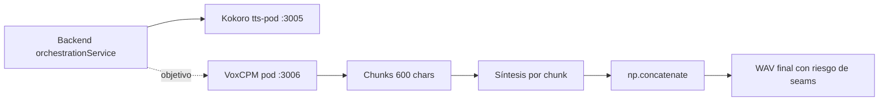
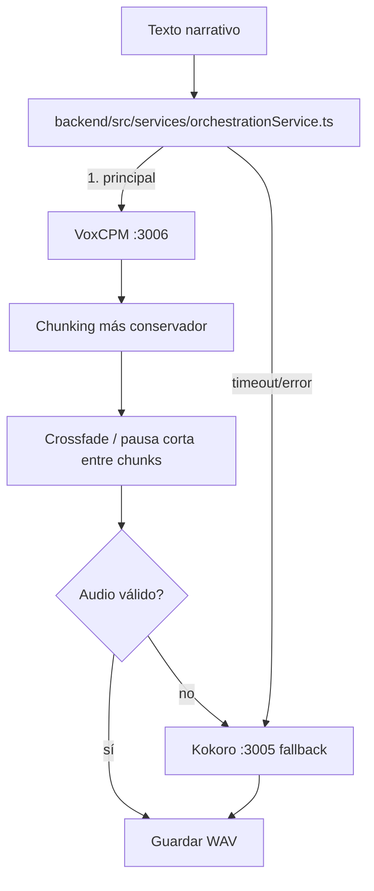

# Pipeline TTS: VoxCPM primario, Kokoro fallback

> Documento de planificación. No cambia comportamiento de producción hasta que se implemente en código.

## Estado actual

- `pods/voxcpm-pod` usa `openbmb/VoxCPM2` en puerto `3006`.
- VoxCPM corta texto en chunks de `600` caracteres, sintetiza cada chunk por separado y une audio con `np.concatenate()`.
- Este concatenado directo puede producir cortes, clics o cambios perceptibles de prosodia en las uniones.
- `pods/tts-pod` ejecuta Kokoro en puerto `3005`; debe mantenerse como fallback.
- La orquestación de fallback deberá cablearse después en `backend/src/services/orchestrationService.ts`.

## Estado objetivo

VoxCPM será la voz principal por calidad, con Kokoro como respaldo operativo si VoxCPM falla, tarda demasiado o devuelve audio inválido.

## Roadmap de implementación

### Fase TTS-1 — Cablear fallback sin cambiar contratos públicos

Archivo futuro: `backend/src/services/orchestrationService.ts`.

1. Intentar generación con VoxCPM (`:3006`) como proveedor primario.
2. Aplicar timeout corto y validación mínima: bytes no vacíos, content-type/forma WAV esperada.
3. Si falla, reintentar con Kokoro (`:3005`) manteniendo el flujo actual de guardado.

Por qué importa / riesgo reducido:
- Reduce el riesgo de dejar una generación sin audio por una caída de VoxCPM.
- Mantiene Kokoro como ruta probada mientras se adopta VoxCPM.

Criterios de aceptación:
- Si VoxCPM responde correctamente, se guarda audio VoxCPM.
- Si VoxCPM falla o expira, Kokoro genera audio sin romper la creación del tour.
- No cambia el contrato API de tour ni el formato de almacenamiento.

### Fase TTS-2 — Reducir seams de VoxCPM

Archivos futuros:
- `pods/voxcpm-pod/src/services/voxcpm.py`
- `pods/voxcpm-pod/src/utils/sanitize.py`

Cambios previstos:
1. Mantener un `voice description` canónico por idioma durante toda la generación.
2. Medir tamaños de chunk `600`, `800` y `1000` caracteres; elegir el mejor balance entre VRAM, latencia y continuidad de voz.
3. Priorizar cortes en puntuación y frases completas.
4. Sustituir `np.concatenate()` directo por unión con crossfade corto o pausa controlada.
5. Si el crossfade no elimina el cambio de voz, comparar dos modos de prompt: descripción de voz en cada chunk vs solo en el primer chunk.

Por qué importa / riesgo reducido:
- Reduce clics/cortes audibles sin reescribir el pod.
- Evita perder la ventaja de calidad de VoxCPM por artefactos de concatenación.

Criterios de aceptación:
- En narraciones largas, no hay clics fuertes ni saltos obvios en uniones.
- La voz no cambia perceptiblemente de persona entre chunks.
- La duración total no cambia de forma significativa.
- Si el crossfade falla, el pod puede volver a una unión simple de forma segura.

### Fase TTS-3 — Observabilidad mínima

Registrar proveedor usado (`voxcpm` o `kokoro`), número de chunks y fallback aplicado.

Por qué importa / riesgo reducido:
- Permite distinguir errores de texto, VoxCPM, Kokoro y almacenamiento.

Criterios de aceptación:
- Cada audio generado indica proveedor final y causa de fallback si aplica.
