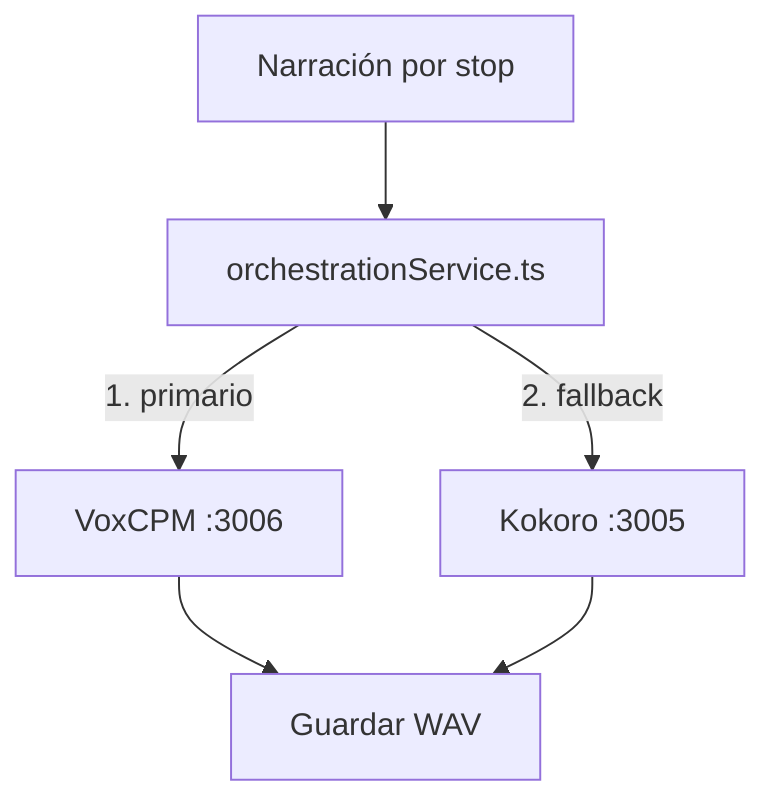

# Consistencia de Voz en el Pipeline TTS

> Estado: Fase TTS-5 implementada el 2026-05-24 con referencias WAV reutilizables por idioma/modelo/perfil y auditoría DB/backend. Seed no soportado por la API pública revisada.

## Objetivo

Documentar cómo funciona la voz en ambos proveedores TTS, por qué VoxCPM puede producir voces inconsistentes entre stops, y planificar una solución.

## Proveedores TTS activos



## Mecanismo de voz por proveedor

### Kokoro (tts-pod, puerto 3005)

**Archivo**: `pods/tts-pod/src/services/kokoro.ts`

| Propiedad | Valor |
|-----------|-------|
| Tipo de voz | Archivos de voz con nombre (ej. `af_sarah`) |
| ¿Determinista? | Sí — mismo nombre de voz = misma salida |
| ¿Parámetro `voice`? | Sí, aceptado y usado |
| Inicialización | Nueva instancia Python por cada stop |
| ¿Cambia entre stops? | No — `af_sarah` produce timbre consistente |

**Cómo funciona**:
1. El backend envía `{ text, language, voice: 'af_sarah' }` en `POST /tts/generate`.
2. Kokoro carga el archivo de voz `af_sarah` y sintetiza.
3. Cada llamada re-inicializa Kokoro, pero como el archivo de voz es determinista, la salida es consistente.

### VoxCPM (voxcpm-pod, puerto 3006)

**Archivo**: `pods/voxcpm-pod/src/services/voxcpm.py`

| Propiedad | Valor |
|-----------|-------|
| Tipo de voz | Descripción textual interpretada por el modelo |
| ¿Determinista? | **No** — cada llamada es una interpretación fresca |
| ¿Parámetro `voice`? | Sí — se resuelve a perfiles estables `guide_<lang>` o descripción explícita segura |
| ¿Seed/reproducibilidad? | No soportado por `VoxCPM.generate()` en la API pública revisada |
| ¿Referencia de voz? | Sí — TTS-5 crea/reutiliza un WAV bootstrap por idioma/modelo/perfil y lo pasa como `reference_wav_path`/`reference_id` |
| Inicialización | Modelo cargado una vez (singleton), pero cada `generate()` es independiente |
| ¿Cambia entre stops? | Debe reducirse con referencia estable; si falla, vuelve a Voice Design y puede variar |

**Cómo funciona desde TTS-5**:

```python
def generate_speech(self, text, language="en", voice=None, speed=None, audio_format="wav"):
    # 1. VOICE se resuelve a un perfil VoxCPM estable, por ejemplo guide_fr.
    voice_profile, desc = resolve_voice_description(voice, language)

    # 2. Se trocea el texto en chunks de ~420 chars por límites de frase.
    chunks = chunk_text(cleaned)

    # 3. Se resuelve o crea una referencia WAV reusable.
    reference = self._resolve_voice_reference(language, voice_profile, desc, reference_id, reference_wav_path)

    # 4. Modo preferido: todos los chunks usan la misma referencia.
    wav = self.model.generate(text=part, reference_wav_path=reference["path"], reference_id=reference["id"])

    # 5. Si reference mode falla, fallback al Voice Design anterior:
    wav = self.model.generate(text=f"({desc}){part}")

    # 6. Se unen con crossfade + silencio corto configurable y se normalizan.
    audio = normalize_audio(join_audio_chunks(wav_chunks, sample_rate))
```

**Referencia persistida**: el backend crea o reutiliza un registro en `voice_reference_audio` para `language + provider + model + voiceProfile`, y envía su `id` como `referenceId` al pod. La primera llamada para ese `referenceId` crea un clip corto bajo `AUDIO_CACHE/voice_references/<referenceId>.wav`; las llamadas siguientes reutilizan ese WAV y actualizan `AUDIO_CACHE/voice_references/manifest.json` como auditoría pod-side.

**Fallback**: si crear la referencia o generar con `reference_wav_path`/`reference_id` falla, el pod vuelve al modo Voice Design TTS-4 para preservar VoxCPM primario y el fallback Kokoro backend existente.

**Limitación actual**: La API pública revisada de `VoxCPM.generate()` acepta `prompt_wav_path`, `prompt_text`, `reference_wav_path`, `cfg_value` e `inference_timesteps`, pero no `seed`, `random_state`, `generator` o `torch_generator`. TTS-5 reduce la raíz del problema al condicionar todos los chunks con una referencia común, pero requiere escucha manual/runtime para confirmar la mejora perceptual en el modelo instalado.

### Comparación directa

| | Kokoro | VoxCPM |
|---|---|---|
| Mecanismo de voz | Archivo de voz con nombre | Referencia WAV reusable; fallback a descripción textual |
| Consistencia entre stops | Alta (determinista) | Mejorada por referencia estable; variable si fallback |
| Parámetro `voice` | Funcional | Funcional como perfil/descripción de voz |
| Seed/reproducibilidad | Implícita (archivo fijo) | No soportada en API pública revisada |
| Calidad de voz | Buena, robótica ligera | Excelente, natural |
| Chunking | No (texto completo) | Sí (~420 chars por chunk, límites de frase) |

## TTS-5 — Estado implementado 2026-05-24

- `pods/voxcpm-pod/src/services/voxcpm.py` crea o reutiliza un WAV bootstrap estable para `voxcpm + MODEL_ID + language + voiceProfile`.
- Los chunks se generan primero con `reference_wav_path` y `reference_id`.
- Si reference mode falla, se registra warning y se regenera con el modo Voice Design anterior.
- El cosido mantiene crossfade de 35ms, añade silencio corto configurable con `VOXCPM_CHUNK_SILENCE_MS` (default 20ms), y normaliza el audio final.
- `pods/voxcpm-pod/src/routes/tts.py` acepta `referenceId` y `referenceWavPath` opcionales sin romper el contrato actual.
- `pods/voxcpm-pod/src/utils/sanitize.py` reduce chunks a ~420 caracteres y sólo divide por final de frase (`.`, `!`, `?`).
- `backend/prisma/schema.prisma` añade `VoiceReferenceAudio`, mapeado a `voice_reference_audio`, con unicidad en `language + provider + model + voiceProfile`.
- `backend/src/services/orchestrationService.ts` crea/reutiliza el registro DB antes del loop de audio y pasa `referenceId` a VoxCPM; si esto falla, envía VoxCPM sin referencia y conserva el fallback Voice Design/Kokoro.
- Migraciones aplicadas: `20260524150000_add_voice_reference_audio_cache` y ajuste Prisma `20260524155320_add_voice_reference_audio_cache`.

## Opciones para resolver la inconsistencia

### Opción A: Usar Kokoro como fallback para stops secundarios

**Descripción**: VoxCPM para el primer stop (donde la calidad impacta más), Kokoro para los stops 2..N.

**Ventajas**:
- Sin cambios en VoxCPM.
- Kokoro ya es determinista y consistente.
- Primer stop recibe la mejor calidad de voz.
- Implementación trivial en `orchestrationService.ts`.

**Desventajas**:
- Cambio perceptible de voz entre stop 1 y stop 2 (diferente motor TTS).
- No aprovecha VoxCPM para todos los stops.
- La calidad de Kokoro es inferior a VoxCPM.

**Archivos a modificar**: `backend/src/services/orchestrationService.ts` (~línea 896-899, lógica de providers).

### Opción B: Investigar soporte de seed en VoxCPM2

**Descripción**: VoxCPM2 puede aceptar un parámetro `seed` o `generator` en `model.generate()`. Si existe, usarlo para hacer la generación determinista.

**Ventajas**:
- VoxCPM para todos los stops con voz consistente.
- Máxima calidad de voz.
- Cambio mínimo si el parámetro existe.

**Desventajas**:
- Requiere investigación previa (la API de VoxCPM2 no está completamente documentada).
- Puede que no exista soporte de seed.
- Si existe, hay que probar que realmente produce voz idéntica (no solo "similar").

**Archivos a modificar**: `pods/voxcpm-pod/src/services/voxcpm.py` (~línea 78).

**Investigación necesaria**:
1. Revisar documentación de `openbmb/VoxCPM2` para parámetros `seed`, `random_state`, o `generator`.
2. Probar con seed fijo en 3 stops consecutivos, mismo texto, comparar waveforms.
3. Si las waveforms son idénticas (o casi), implementar.

### Opción C: Misma descripción de voz + temperature=0

**Descripción**: Asegurar que la descripción de voz es idéntica para todos los stops (ya lo es por idioma) y reducir `cfg_value` o `inference_timesteps` para minimizar variación.

**Ventajas**:
- Sin cambios de API.
- Ya se hace (misma descripción por idioma).

**Desventajas**:
- **No resuelve el problema**. La variación no viene de la descripción (que ya es idéntica), sino de la naturaleza no determinista de la inferencia del modelo.
- Reducir `cfg_value` puede degradar calidad.

**Archivos a modificar**: `pods/voxcpm-pod/src/services/voxcpm.py` (línea 78, parámetros `cfg_value`, `inference_timesteps`).

### Opción D: VoxCPM primer stop + Kokoro resto

**Descripción**: Híbrido — primer stop usa VoxCPM (impacto inicial), stops 2..N usan Kokoro (consistencia).

**Ventajas**:
- Combina lo mejor de ambos: calidad inicial + consistencia.
- Implementación simple.
- Sin cambios en pods.

**Desventajas**:
- Cambio de timbre entre stop 1 (VoxCPM) y stop 2 (Kokoro).
- El usuario nota el cambio de motor TTS.

**Archivos a modificar**: `backend/src/services/orchestrationService.ts` (~línea 896-899).

## Recomendación

### Camino recomendado

```
1. INVESTIGAR seed en VoxCPM2
   ├─ ¿Existe parámetro seed/random_state?
   │  ├─ SÍ → Opción B: implementar seed fijo
   │  │        Archivo: voxcpm.py:78
   │  │        Riesgo: bajo
   │  └─ NO → Continuar
   │
   └─ ¿cfg_value=1.0 + inference_timesteps altos reduce variación?
      ├─ SÍ → Opción C: ajustar parámetros
      │        Archivo: voxcpm.py:78
      │        Riesgo: medio (posible degradación de calidad)
      └─ NO → Opción D: VoxCPM stop 1 + Kokoro stops 2..N
               Archivo: orchestrationService.ts:896-899
               Riesgo: bajo (cambio de timbre audible pero aceptable)
```

### ¿Por qué no Kokoro para todo?

Kokoro ya es el fallback actual. La calidad de voz de VoxCPM es **significativamente superior** — más natural, mejor prosodia, más expresiva. El live test de Madrid confirmó 0 fallbacks de narración con `llama3.1:8b` y VoxCPM como primario. Renunciar a VoxCPM para todos los stops sería una regresión de calidad.

### ¿Por qué no ignorar el problema?

La inconsistencia de voz entre stops es **sutil pero real**. En un tour de 6 stops, el usuario nota que "la voz cambia ligeramente" entre el primer y el último stop. No es un bug crítico, pero degrada la experiencia inmersiva que el tour busca crear. Arreglarlo con la opción correcta (seed) es preferible a parchearlo con un híbrido.

## Plan de implementación

### Estado implementado 2026-05-24

- Investigación: el paquete no estaba instalado en el host CLI, así que no se pudo hacer introspección local por import sin instalar dependencias/modelos. Se revisó la API pública upstream de `openbmb/VoxCPM`: `VoxCPM.generate()` no expone parámetro de seed/reproducibilidad.
- `pods/voxcpm-pod/src/services/voxcpm.py`: `voice` ahora se resuelve con `resolve_voice_description()` a perfiles estables `guide_en`, `guide_es`, `guide_fr`, `guide_de`, `guide_it`, o a una descripción explícita saneada. IDs cortos de Kokoro como `af_sarah` caen al perfil VoxCPM por idioma.
- `backend/src/services/orchestrationService.ts`: backend envía `VOXCPM_VOICE_PROFILE || guide_<language>` a VoxCPM y conserva `TTS_DEFAULT_VOICE || af_sarah` para Kokoro fallback.
- Logging: VoxCPM registra `voiceProfile`, `language`, `chunks` y `seedSupported: false`; backend registra el perfil enviado por stop.
- Validación: `python3 -m py_compile src/services/voxcpm.py src/routes/tts.py` pasó; `npm run build` en backend pasó.
- Limitación: no se ejecutó generación de audio real ni listening test porque cargar/generar VoxCPM es costoso y el paquete/modelo no estaba disponible en el host CLI.

### Fase TTS-4.1 — Investigar soporte de seed en VoxCPM2

**Archivo**: `pods/voxcpm-pod/src/services/voxcpm.py`

**Tarea**: Revisar documentación y API de `openbmb/VoxCPM2` para:
- Parámetros `seed`, `random_state`, `generator`, `torch_generator` en `model.generate()`.
- Si existe, probar con seed fijo (`42`) en 3 stops consecutivos con texto idéntico.
- Comparar waveforms: ¿son idénticas o similares?

**Por qué importa / riesgo reducido**:
- Determina si la solución óptima (VoxCPM consistente) es viable sin cambios mayores.
- Evita implementar un híbrido si el seed funciona.

**Criterios de aceptación**:
- Documentación de VoxCPM2 revisada para parámetros de reproducibilidad.
- Si existe seed: prueba con 3 stops muestra waveforms idénticas o casi idénticas.
- Si no existe: se registra la limitación y se procede a TTS-4.2 (híbrido).

### Fase TTS-4.2 — Implementar solución de consistencia

**Opción preferida (si seed existe)**:

**Archivo**: `pods/voxcpm-pod/src/services/voxcpm.py`, línea 78.

```python
# Antes:
wav = self.model.generate(text=prompt, cfg_value=2.0, inference_timesteps=10)

# Después:
wav = self.model.generate(
    text=prompt,
    cfg_value=2.0,
    inference_timesteps=10,
    seed=42  # seed fijo para consistencia entre stops
)
```

**Opción de fallback (si seed no existe)**:

**Archivo**: `backend/src/services/orchestrationService.ts`, líneas 896-899.

```typescript
// Proveedor primario: VoxCPM para el primer stop, Kokoro para el resto
const isFirstStop = position === 0;
const providers = isFirstStop
  ? [...(this.voxcpmServiceUrl ? [{ name: 'VoxCPM', url: this.voxcpmServiceUrl }] : []),
     { name: 'Kokoro', url: this.kokoroServiceUrl }]
  : [{ name: 'Kokoro', url: this.kokoroServiceUrl }];
```

**Por qué importa / riesgo reducido**:
- Si seed funciona: solución óptima, VoxCPM para todos los stops con voz consistente.
- Si seed no funciona: híbrido aceptable, primer stop con máxima calidad, resto consistente.
- Sin cambios de contrato API, schema, o frontend.

**Criterios de aceptación**:
- Con seed: 3 stops consecutivos tienen voz indistinguible (escucha manual).
- Con híbrido: stop 1 usa VoxCPM, stops 2..N usan Kokoro (verificar en logs).
- `npm run build` en backend pasa.
- `python3 -m py_compile src/services/voxcpm.py` en voxcpm-pod pasa.

## Notas para el implementador

1. **El parámetro `voice` en `TTSRequest` es ignorado por VoxCPM**: La interfaz `TtsRequest` (definida en `pods/voxcpm-pod/src/routes/tts.py`) acepta `voice`, pero `voxcpm.py:59` nunca lo usa. Esto no es un bug — el modelo VoxCPM2 no tiene un sistema de voces con nombre como Kokoro. La "voz" se controla exclusivamente mediante la descripción textual en el prompt.

2. **El backend ya envía `voice`**: `orchestrationService.ts:887` envía `voice: process.env.TTS_DEFAULT_VOICE || 'af_sarah'`. Esto es útil para Kokoro pero irrelevante para VoxCPM.

3. **No confundir "consistencia de voz" con "calidad de voz"**: VoxCPM tiene mejor calidad (más natural), pero Kokoro tiene mejor consistencia (determinista). El objetivo es obtener ambas.

4. **La voz de VoxCPM se define por idioma**: `VOICE_DESCRIPTIONS` en `voxcpm.py:14-20` tiene descripciones para `en`, `es`, `fr`, `de`, `it`. Si se añaden más idiomas, hay que añadir descripciones.
