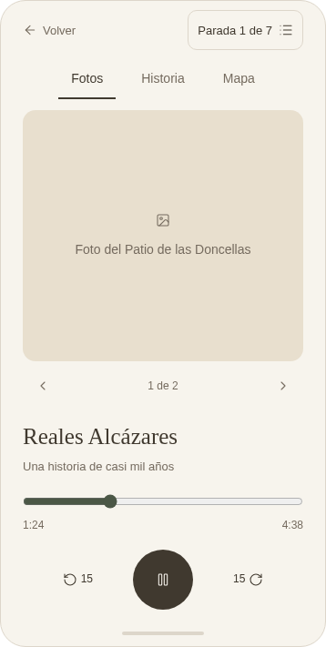
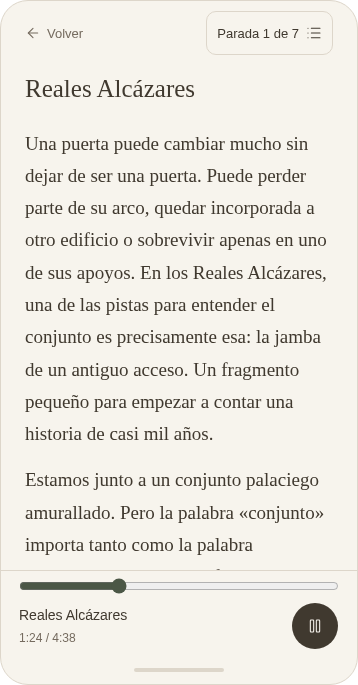
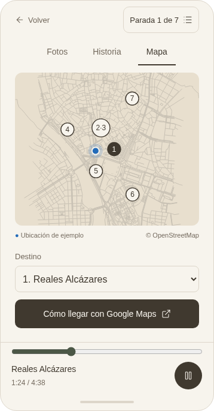
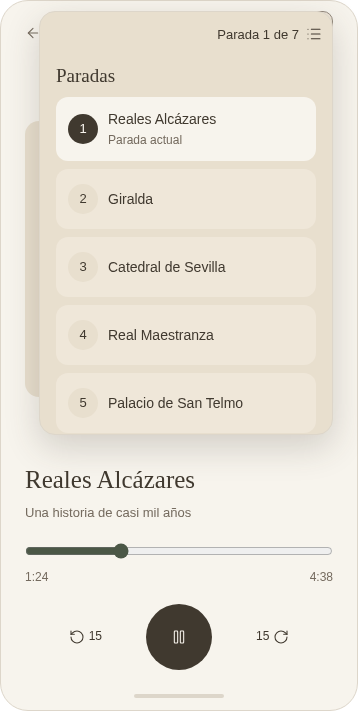
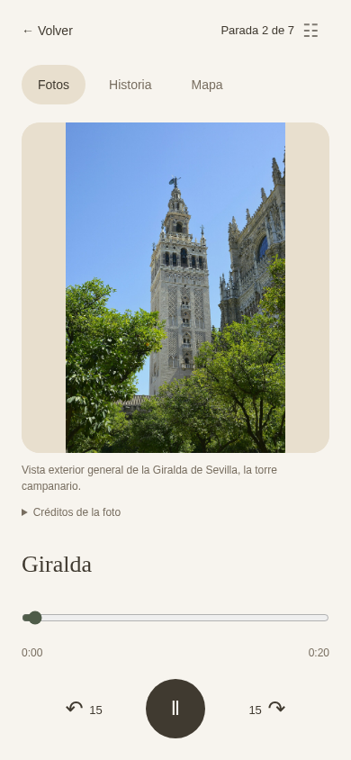
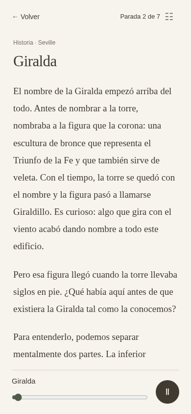
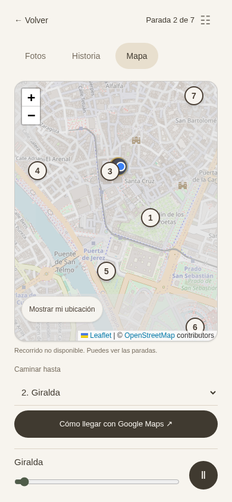
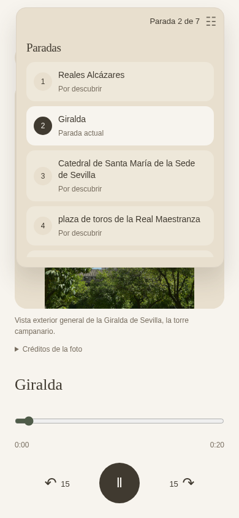

# Tour móvil: escuchar, mirar y leer

Fecha: 8 de septiembre de 2026. Diseño acordado con el usuario.

## Referencia aprobada

La referencia es la [maqueta interactiva](assets/sevilla-listening-prototype.html). Incluye fotos de ejemplo, tiempos simulados y una ubicación ficticia; el mapa y los relatos proceden del tour de Sevilla. La implementación debe usar los recursos reales del tour.

## Objetivo

Usar el tour caminando con el móvil: iniciar la narración, guardar el teléfono y recuperar la misma parada y el mismo segundo al regresar. La pantalla se centra en la imagen y el audio. Leer y consultar el mapa son opciones secundarias. La estructura debe poder reutilizarse en una futura app.

## Pantallas y navegación

- **Fotos:** imagen real de la parada en el centro; galería con flechas y gesto horizontal cuando exista más de una imagen. Nombre, duración real, progreso, reproducir/pausar y ±15 segundos abajo. Créditos disponibles sin ocupar la vista principal. Un estado cuidado sustituye imágenes ausentes o fallidas.
- **Historia:** el texto completo pasa a ocupar el espacio central con desplazamiento vertical. Audio compacto y permanente abajo; el nombre no abre otro reproductor. Volver recupera Fotos. Cambiar de vista conserva el audio y la lectura; la narración no fuerza el desplazamiento del texto.
- **Mapa:** mapa real y ubicación propia tras conceder permiso. El destino elegido para caminar es independiente de la parada que se escucha. Google Maps se abre con indicaciones a pie hacia ese destino. Volver recupera Fotos. Sin ubicación o sin ruta calculada siguen disponibles las paradas y el enlace externo.
- **Volver desde Fotos:** regresa a la lista de tours guardando el progreso. Dentro del tour, el historial del navegador permite regresar de Historia/Mapa a Fotos.
- **Selector de paradas:** el propio botón «Parada 1 de 7» se transforma en un rectángulo flotante, con el tono más oscuro de la imagen de referencia. Cada opción tiene una superficie suave, espacio, número y nombre; se destaca la actual. Se cierra al elegir, tocar fuera o pulsar Escape. Mantiene la pantalla subyacente. Sin flechas para cambiar de parada.
- **Cambio de parada:** se guarda la anterior, se prepara la elegida sin reproducción automática y se conserva el modo abierto (Fotos/Historia/Mapa). Seleccionar la misma parada no interrumpe nada. Elegir un destino en el mapa nunca cambia el audio.

## Mejoras funcionales incluidas

1. **Final de narración:** mostrar que la parada se ha escuchado, la siguiente parada y cómo llegar. Avanzar es voluntario. La última parada ofrece cierre y regreso a los tours; no implica que se hayan escuchado las anteriores.
2. **Reanudación:** guardar por tour/parada posición de audio, duración conocida, finalización y punto de lectura. Restaurar de forma pausada tras recargar. Guardar al pausar, cambiar, ocultar la página y salir; tolerar almacenamiento bloqueado o inválido.
3. **Estado de cada parada:** «Escuchada» solo después de finalizar la narración; «A medias» cuando hay progreso sin finalización. La selección no marca una parada como escuchada. Reproducir otra vez no borra que ya se escuchó.
4. **Recuperación:** estados pequeños y comprensibles de preparación, carga, error y reintento. No exponer mensajes técnicos. Reutilizar los endpoints de audio existentes y su preparación/reintento.
5. **Controles del sistema:** integrar Media Session cuando exista para reproducir, pausar y saltar en la narración actual. No avanzar automáticamente entre lugares desde esos controles. Probar pantalla bloqueada, auriculares e interrupciones en dispositivos reales antes de afirmar compatibilidad plena.
6. **Limpieza:** retirar del tour público los paneles Draft, resumen editorial, avisos redundantes y la barra «Text guide». La UI no cambia estados ni reglas de publicación de la base de datos.

## Criterios visuales y accesibilidad

Superficie beige, tipografía legible y controles al alcance del pulgar. Interfaz en español/francés según el tour, con fallback inglés. Soportar desde 320 px, pantallas cortas, orientación horizontal y área segura del móvil. Controles táctiles de al menos 44 px, foco visible, etiquetas accesibles, mensajes de estado y movimiento reducido. El mapa, la galería y el texto nunca provocan que el audio se vuelva a crear por cambiar de vista.

El selector toma las coordenadas y dimensiones reales de su botón; CSS anima el rectángulo desde ese punto, sin necesitar soporte de CSS Anchor Positioning. El menú sigue cerrándose al tocar fuera. Se utiliza una única lista flotante controlada por la pantalla, sin depender de la API Popover ni convertirla en una vista aparte.

## Implementación y verificación

Reutilizar React, HTMLAudioElement, Leaflet, metadatos de imágenes verificados y servicios de audio existentes. No añadir dependencias. El progreso queda en este navegador; no se promete sincronización entre dispositivos ni descarga offline.

Validar con una prueba ejecutable del flujo completo: reproducir, abrir Historia, cambiar fotos/mapa, cerrar selector sin interrupción, cambiar parada, recargar y reanudar, finalizar una parada y finalizar la última sin marcar anteriores. Incluir red fallida, permisos denegados, imágenes ausentes y movimiento reducido. Verificar con el tour real de Sevilla y con audio de prueba para los estados temporales.

## Estado de entrega

Implementado en la página real del tour. Sin dependencias nuevas y sin cambios en datos, publicación ni generación del backend.

### Capturas de la implementación

Interfaz final con los datos, relatos y fotos reales de Sevilla. Las capturas usan audio de prueba de 20 segundos para mostrar el reproductor mientras se actualizan las narraciones definitivas. La posición del mapa también está simulada cerca de la Giralda; no representa la ubicación física del dispositivo de prueba.

### Verificación realizada

- Compilación de producción, comprobación de tipos y lint: correctos.
- Prueba ejecutable: `frontend/scripts/test-tour-listening.cjs`. Audio WAV de 20 segundos servido durante la prueba, sin escribir en la base de datos. Comprueba continuidad del mismo reproductor entre vistas, galería, lectura recordada, menú por selección/toque exterior/Escape, destino independiente, pausa al cambiar, reanudación tras recargar, saltos de 15 segundos, finalización y repetición, error/reintento, fotos ausentes, permiso denegado y almacenamiento bloqueado. También verifica el funcionamiento sin la API Popover y la ausencia de errores del navegador.
- Prueba con el tour de Sevilla, sin sustituir las respuestas de sus servicios: reproducción de la Giralda (duración real 250,398 segundos), continuidad en Historia/Mapa, foto real y marcador de ubicación con coordenadas simuladas. Sin errores del navegador.
- Revisión móvil a 390 × 844 y 320 × 568, horizontal a 844 × 390 y escritorio a 1280 × 900. En pantallas muy bajas, el reproductor reduce sus controles para mantener reproducir/pausar y progreso visibles.
- Verificadas las siete paradas dentro del encuadre después del permiso de ubicación. El mapa se reajusta cuando cambia su tamaño; el selector usa una lista flotante sencilla con expansión CSS, evitando los restos visuales que producía la capa nativa de Popover en Chromium. Se verificaron las transiciones reales de anchura, altura y opacidad. El cierre es inmediato.
- Corregido un fallo de Leaflet al cerrar la vista durante una transición de zoom. El mapa compacto cambia el zoom sin esa animación; el selector de paradas conserva la expansión aprobada y respeta movimiento reducido.

Para repetir la prueba, iniciar el frontend compilado y ejecutar el script con `BASE_URL` apuntando a ese servidor. Requiere Playwright instalado en el entorno; `PLAYWRIGHT_MODULE` permite señalar su módulo y `CHROMIUM_PATH` su navegador sin añadir dependencias al producto. El bloqueo de almacenamiento se comprueba sobre producción: las herramientas de desarrollo de Next acceden a su propio almacenamiento antes de iniciar la aplicación.

### Estado del contenido de Sevilla

Tour `612a437d-5858-4b7e-bbab-97b63dbbccf6`: al iniciar la revisión había seis audios vigentes y la primera narración necesitaba actualizar su texto. Se probó entonces la reproducción real de la Giralda. En la comprobación final el servicio devuelve **0 de 7 audios vigentes**: los siete archivos anteriores existen, pero ninguno coincide ya con la configuración de voz actual. Deben actualizarse mediante la generación existente; este cambio de interfaz no modifica sus archivos ni la configuración de voz.

El servicio incluye la introducción en la narración inicial; Historia muestra también esa introducción para mantener la correspondencia. Las paradas pendientes muestran un mensaje breve y «Preparar audio», usando la acción existente. En esta sesión el servicio de ruta a pie tampoco devolvió el trazado; el mapa mantuvo las siete paradas, la ubicación y el enlace de indicaciones de Google Maps.

### Comprobación pendiente en dispositivos físicos

Probar pantalla bloqueada, auriculares, llamadas y retorno desde Google Maps en iOS y Android reales. Media Session está integrada, pero las pruebas automatizadas de escritorio no certifican esos comportamientos del sistema operativo. El progreso se guarda en este navegador; no hay sincronización entre dispositivos ni descarga offline.
