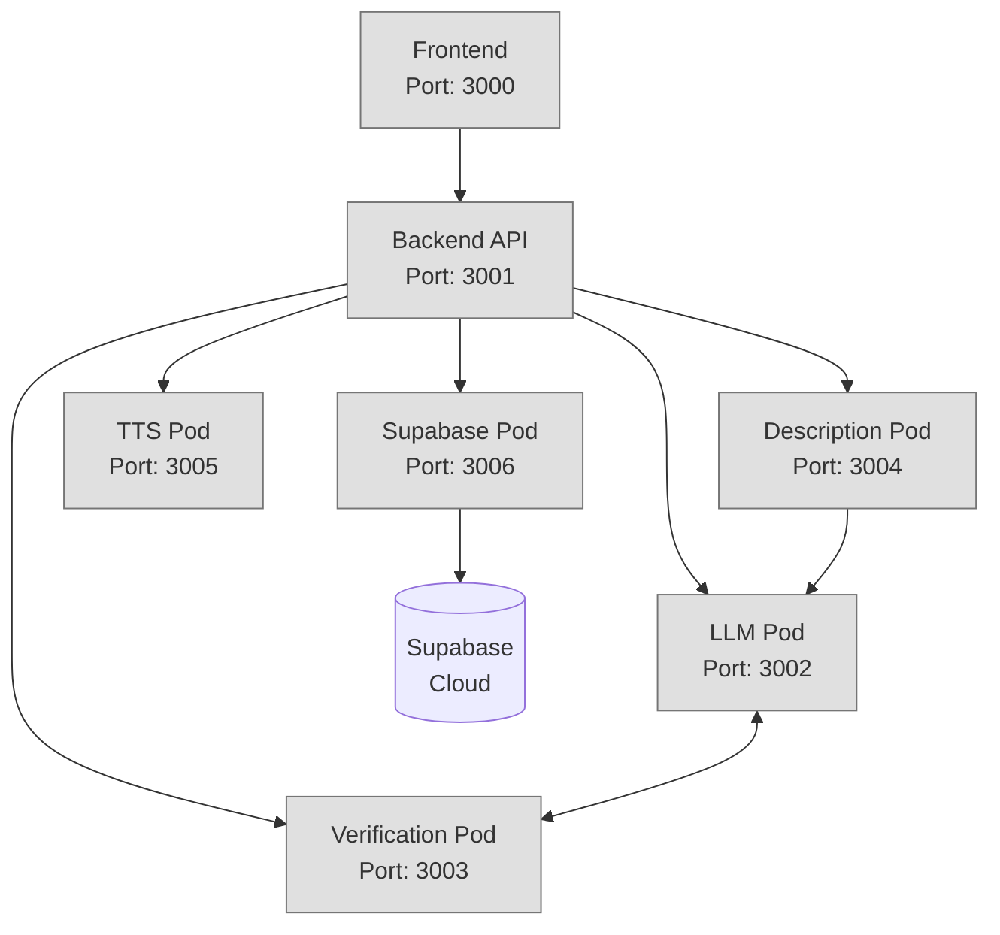

# Tour Guide App Development Roadmap

## Current Status
The Tour Guide App has all core components working:
- ✅ Frontend with basic tour creation interface
- ✅ Backend API for orchestration
- ✅ LLM Pod with generation & translation capabilities 
- ✅ Verification Pod with place & route validation
- ✅ Description Pod with narrative tour features
- ✅ TTS Pod with multi-language speech synthesis
- ✅ Supabase Pod with database & storage integration

## Development Phases

### Phase 1: Core Functionality Enhancement (Completed)
1. **Fix importance scoring in verification pod**
   - Implement tag-based scoring in `stopAnalysis.ts`
   - Add weights for different OSM tags:
     * Tourism tags (0.7 base score)
     * Historical significance (0.7 base score)
     * Cultural venues (0.6 base score)
   - Consider metadata bonuses:
     * Wikipedia/Wikidata presence (+0.2)
     * Multiple relevant tags (+0.1 each)
     * High OSM importance (+0.1-0.3)
   - Return accurate scores in route responses
   - ✅ Completed

### Phase 2: Content Enrichment (Completed)
2. **Add Description Pod**
   - Setup new service architecture:
     * Port 3004
     * LLM integration
     * Caching layer for generated content
   - Implement endpoints:
     * `/generate/description` - Basic place description
     * `/generate/context` - Historical & cultural context
     * `/generate/tips` - Visitor recommendations
   - Add content features:
     * Multi-language support via LLM pod
     * Narrative tour experience with position-aware content
     * Smooth transitions between tour stops
   - ✅ Completed

3. **Add TTS Pod**
   - Setup service infrastructure:
     * Port 3005
     * Integration with Kokoro TTS and espeak-ng
     * Audio file caching
   - Core features:
     * Text-to-speech conversion with dual engines
     * Smart language routing (Kokoro for English, espeak-ng for others)
     * Multiple voice options per language
     * Natural pacing & breaks
   - Audio management:
     * File format optimization
     * Chunked delivery
     * Efficient caching system
   - ✅ Completed

4. **Add Supabase Integration Pod**
   - Setup service architecture:
     * Port 3006
     * Supabase client for database & storage
     * Authentication middleware
   - Core features:
     * Tour persistence in Supabase
     * Secure API with authentication
     * Cloud storage for audio files
     * User management integration
   - Data management:
     * Storage & retrieval of complete tours
     * Audio file management
     * Metadata tracking for analytics
   - ✅ Completed

### Phase 3: End-to-End Integration (Completed)
5. **Connect all components for complete workflow**
   - Implement API Gateway & Orchestration:
     * Define comprehensive API contract ✅
     * Create unified frontend-to-backend integration ✅
     * Standardize request/response formats ✅
   - Implement complete end-to-end flows:
     * Tour generation flow ✅
     * Tour retrieval flow ✅
     * Tour update flow ✅
   - Add system resilience:
     * Error handling and recovery ✅
     * Performance optimization ✅
     * Monitoring and logging ✅
   - Enhance narrative quality:
     * Improve conversational tone in descriptions ✅
     * Implement position-aware tour structure (first/middle/last stops) ✅
     * Fix TTS compatibility with narrative text ✅
   - Timeline: 3 weeks ✅ COMPLETED

### Phase 4: System Intelligence
6. **Implement LLM-Verification feedback loop**
   - Add verification failure handling:
     * Detect specific failure types
     * Generate targeted alternatives
     * Consider place relationships
   - Improve place suggestions:
     * Learn from user choices
     * Consider time & weather
     * Regional popularity data
   - Expected timeline: 2 weeks

7. **Enhance route optimization**
   - Advanced algorithms:
     * Traveling Salesman variants
     * Multi-objective optimization
     * Time window constraints
   - Smart routing features:
     * Time-of-day traffic patterns
     * Popular vs quiet times
     * Weather considerations
   - Expected timeline: 3 weeks

## Architecture Diagram



## Integration Workflow

1. **Phase 1**: Place Importance & Description (Completed)
   ```
   Frontend → Backend → Verification Pod
                    ↳ LLM Pod
                    ↳ Description Pod → LLM Pod
   ```

2. **Phase 2**: Audio Generation & Storage (Completed)
   ```
   Frontend → Backend → Description Pod → LLM Pod
                    ↳ TTS Pod → Audio Files ✅
                    ↳ Supabase Pod → Supabase Cloud ✅
   ```

3. **Phase 3**: End-to-End Integration (Current)
   ```
   Frontend ←→ Backend ←→ All Pods
     |                      |
     v                      v
   User Experience       Data Storage
   ```

4. **Phase 4**: Smart System
   ```
   Frontend → Backend → LLM Pod ←→ Verification Pod
                    ↳ Description Pod
                    ↳ TTS Pod
                    ↳ Supabase Pod
   ```

## Resource Requirements

### Development
- Node.js & TypeScript expertise
- LLM prompt engineering
- Audio processing experience
- Supabase/PostgreSQL knowledge
- Algorithm optimization skills

### Infrastructure
- Container orchestration
- Audio file storage
- Caching system
- High-availability setup
- Supabase project

## Success Metrics

1. **Phase 1** (Completed):
   - Importance scores correctly reflect place significance
   - 95%+ accuracy in place categorization

2. **Phase 2** (Completed):
   - Rich, engaging descriptions with narrative flow ✅
   - Clear, natural audio narration ✅
   - Efficient cloud storage and retrieval ✅
   - Sub-2s response times ✅

3. **Phase 3** (Current):
   - Complete end-to-end integration
   - Unified API contract
   - Robust error handling
   - Optimized performance

4. **Phase 4**:
   - 90%+ first-try success rate
   - Optimal route suggestions
   - Smart alternative handling

## Timeline Overview

```
Phase 1 (1 week)        |████████░░░░|
Phase 2 (5 weeks)       |████████████|
  - Description Pod (3 weeks)  |████████░░| ✅
  - TTS Pod (2 weeks)         |████████░░| ✅
  - Supabase Pod (3 weeks)    |████████░░| ✅
Phase 3 (3 weeks)       |░░░░░░████░░|
Phase 4 (5 weeks)       |░░░░░░░░████|
                        0   2   4   6   8   10  12  14
                            Weeks
