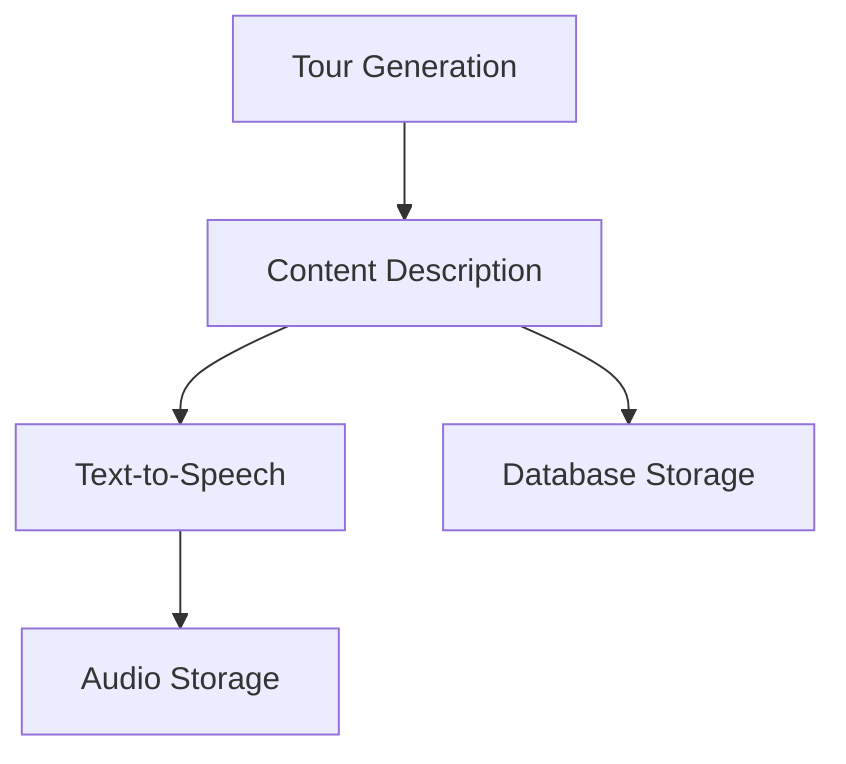

# Features Documentation

This directory contains documentation for the key features of the Tour Guide App.

## Feature Categories

### Tour Generation
- [Country Data Flow](./tour-generation/country-data-flow-implementation.md) - How country data is passed through the system
- [Tour Duration Feature](./tour-generation/tour-duration-feature.md) - Implementation of tour duration estimation
- [Place Verification](./tour-generation/country-data-implementation-plan.md) - Verification of places and their importance

### Tour Browsing & UI
- [Tour Management UI](./tour-browsing/tour-management-ui.md) - Tour listing and browsing interface
- [Visual Hierarchy Guidelines](./ui-design/visual-hierarchy-guidelines.md) - UI design principles for readability and clarity

### Content Creation
- [Conversational Enhancement](./content-creation/conversational-enhancement.md) - Tour guide conversational narration
- [Narrative Description](./content-creation/narrative-description.md) - Position-aware tour narratives
- [Editorial Tone Guide](./content-creation/editorial-tone-guide.md) - Tone system for narration quality and segment fit

### User & Market
- [Buyer Persona: Mateo](./buyer-persona-mateo.md) - Primary autonomous traveler profile
- [Buyer Persona Executive Summary](./buyer-persona-executive-summary.md) - Investor and partner framing for the core user
- [Buyer Persona Segments](./buyer-persona-segments.md) - Additional audience segments for product and marketing
- [Pricing Strategy](./pricing-strategy.md) - Offer structure for single routes, freemium unlocks, and city passes

### Persistence
- Supabase Integration - Database and storage integration
- Tour Data Management - How tour data is stored and retrieved

## Feature Matrix

| Feature                  | Status      | Pod/Service                      | Priority |
|--------------------------|-------------|----------------------------------|----------|
| Place Generation         | ✅ Complete  | LLM Pod                          | High     |
| Place Verification       | ✅ Complete  | Verification Pod                 | High     |
| Description Generation   | ✅ Complete  | Description Pod                  | High     |
| Text-to-Speech           | ✅ Complete  | TTS Pod                          | High     |
| Position-Aware Narratives| ✅ Complete  | Description Pod                  | Medium   |
| Tour Data Persistence    | ✅ Complete  | Supabase Pod                     | Medium   |
| Audio Storage            | ✅ Complete  | Supabase Pod                     | Medium   |
| Conversational Narration | ✅ Complete  | Description Pod + TTS Pod        | Medium   |
| Smart Route Optimization | 🔄 Planned  | Backend                          | Low      |
| LLM-Verification Feedback| 🔄 Planned  | LLM Pod + Verification Pod      | Low      |

## Integration Points

## Recent Improvements

- Enhanced conversational quality in narratives
- Position-aware tour structure with greetings and transitions
- Improved TTS compatibility for better audio quality
