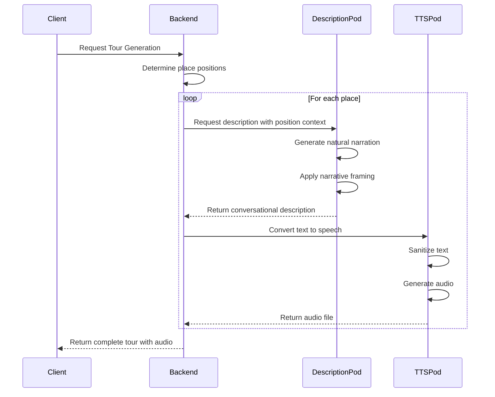

# Conversational Narrative Enhancement

## Overview
This feature transforms the tour guide narration style from formal documentation to natural, spoken-style tour guide narration. It ensures descriptions are conversational, engaging, and fully compatible with text-to-speech systems.

## Implementation Details

### 1. Improved Conversational Prompting
We modified the LLM prompt in `description-pod/src/services/llm-client.ts` to generate natural tour guide narration:

```typescript
const DESCRIPTION_PROMPT_TEMPLATE = `
You are a friendly tour guide speaking directly to visitors.
Create a natural, conversational narration about {place} in {city}, {country}.

Speak as if you're standing with your tour group at the location right now.
Use phrases like "As you can see", "Look at", "Notice", "In front of us".
Address visitors directly using "you" and include engaging questions.

Share interesting facts about the history, cultural significance, and unique features of {place} in a casual, flowing narrative.
Maintain a {detailLevel} level of detail while keeping a warm, {style} speaking tone.

IMPORTANT:
- Don't use ANY formatting like headers, bold text, bullet points, or section titles
- Don't use markdown or special characters like **, #, or ---
- Write ONLY as a continuous spoken narrative that would sound natural when read aloud
- Don't mention that you're an AI or include meta-instructions in your response
`;
```

Key improvements:
- Framed the prompt as a tour guide speaking to visitors in person
- Encouraged spatial references and direct address
- Explicitly prohibited markdown formatting and section headers
- Focused on continuous narration flow rather than structured content

### 2. Position-Aware Tour Structure

The system now creates different narratives based on a place's position in the tour:

#### First Stop
The welcome narrative includes:
- Personalized greeting and tour introduction
- Expected duration information
- Preview of upcoming stops

```typescript
// From narrative-framer.ts
return `Welcome to our ${tourName}! 
Today we'll be exploring ${tourTheme} in ${city}. ${durationInfo} I'm excited to guide you through some of the city's most fascinating locations.
Our first stop is ${place}.
${description}
${nextStopsPreview}`;
```

#### Middle Stops
Transition narratives include:
- References to previously visited locations
- Thematic connections between stops
- Previews of upcoming stops

```typescript
return `Continuing our journey to ${place}. 
Having explored ${previousStopInfo}, let's now discover ${place}.
${transitionHighlight}
${description}
${nextStopTeaser}`;
```

#### Last Stop
Conclusion narratives include:
- Summary of the entire tour experience
- Recapping visited locations
- Thank you message and farewell

```typescript
return `Final stop: ${place}. 
We've reached the final destination on our tour of ${city}'s ${tourTheme}.
${description}
This concludes our journey today. ${tourRecap}, discovering the rich history and culture that makes ${city} so special.
Thank you for joining me on this tour! I hope you've enjoyed this exploration of ${city}'s ${tourTheme}.`;
```

### 3. Orchestration Integration

The orchestration service was updated to automatically apply position context:

```typescript
// In orchestrationService.ts - generateDescriptions method
for (let i = 0; i < places.length; i++) {
  // Determine position in the tour
  let position: 'first' | 'middle' | 'last' = 'middle';
  if (i === 0) position = 'first';
  else if (i === places.length - 1) position = 'last';
  
  // Create next/previous places lists for context
  const previousStops = places.slice(0, i).map(p => ({ 
    name: p.name, 
    category: p.category || '' 
  }));
  const nextStops = places.slice(i + 1).map(p => ({ 
    name: p.name, 
    category: p.category || '' 
  }));
  
  // Build tour context
  const tourContext = {
    position,
    tourTheme: theme,
    tourName: `${city} ${theme} Tour`,
    previousStops,
    nextStops,
    expectedDuration: this.currentRequest?.duration || 120
  };
  
  // Pass context to description service
  const response = await axios.post(`${this.descriptionServiceUrl}/generate/description`, {
    place: enrichedPlace,
    theme,
    language,
    tourContext // Add tour context to the request
  });
}
```

### 4. TTS Compatibility Improvements

To ensure compatibility with text-to-speech systems, we enhanced the `sanitizeTextForPython` method in the TTS pod:

```typescript
private sanitizeTextForPython(text: string): string {
  // Step 1: Remove markdown formatting
  let cleaned = text
    // Remove headers
    .replace(/#+\s+(.*)/g, '$1')
    // Remove bold/italic
    .replace(/\*\*([^*]+)\*\*/g, '$1')
    .replace(/\*([^*]+)\*/g, '$1')
    .replace(/\_\_([^_]+)\_\_/g, '$1')
    .replace(/\_([^_]+)\_/g, '$1')
    // Remove horizontal rules
    .replace(/---+/g, '')
    // Remove bullet points
    .replace(/^\s*[\*\-\•]\s+/gm, '')
    // Remove numbered list formatting
    .replace(/^\s*\d+[\.\)]\s+/gm, '')
    // Remove blockquotes
    .replace(/^\s*>\s+/gm, '');
  
  // Step 2: Remove any markdown links and replace with just the text
  cleaned = cleaned.replace(/\[([^\]]+)\]\([^\)]+\)/g, '$1');
  
  // Step 3: Replace newlines with spaces in cases where it's not a paragraph break
  cleaned = cleaned.replace(/([^\n])\n([^\n])/g, '$1 $2');
  
  // Step 4: Normalize and clean whitespace
  cleaned = cleaned
    .replace(/\s+/g, ' ')
    .replace(/\n\s+/g, '\n')
    .trim();
  
  return cleaned;
}
```

This ensures that any residual formatting that might have slipped through is properly handled before being sent to the TTS engine.

## Flow Diagram



## Benefits

- **More engaging narratives**: Natural-sounding tour guides increase user engagement
- **TTS compatibility**: Clean text ensures high-quality speech synthesis
- **Coherent tour experience**: Position-aware narration creates a flowing, cohesive experience
- **Reduced cognitive load**: Conversational style is easier to process while walking

## Future Improvements

- Further prompt refinement for different tour types (historical, art, gastronomy)
- Dynamic tone adjustment based on location type
- Voice persona consistency across tour stops
- Emotional emphasis markers for TTS to create more dynamic narration
