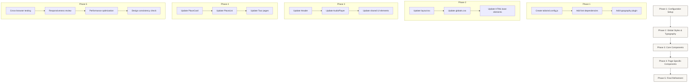

# Design System Migration Plan

This document outlines a structured approach for implementing the new UI design system in the Tour Guide application. The migration will follow a phased approach to minimize disruption while systematically upgrading the visual styling across the application.

## 1. Introduction & Rationale

### Current State
The Tour Guide application currently uses Tailwind CSS with a primarily white, blue, and gray color scheme. Components follow a clean, modern approach but lack some of the visual warmth and sophistication desired in the new design direction.

### Target Design
The new design introduces:
- A warmer color palette with beige, dark brown, and muted gold
- Serif typography with Playfair Display for headings
- A more elegant, minimalist aesthetic
- Rounded elements with subtle shadows
- Consistent spacing and visual hierarchy

### Benefits of Phased Implementation
- Reduces risk by allowing changes to be tested incrementally
- Enables continued development during the migration
- Provides natural points for review and adjustment
- Ensures consistency across the application

## 2. Migration Phases



## 3. Detailed Implementation Steps

### Phase 1: Configuration Setup

1. **Create tailwind.config.js file**

```javascript
// tailwind.config.js
module.exports = {
  theme: {
    extend: {
      colors: {
        beige: '#F7F4EF',
        darkBrown: '#4A3F35',
        mutedGold: '#C0A65F',
      },
      fontFamily: {
        serif: ['Playfair Display', 'serif'],
        sans: ['Inter', 'sans-serif'],
      },
    },
  },
  plugins: [require('@tailwindcss/typography')],
}
```

2. **Add font dependencies**
   - Add Google Fonts (Playfair Display and Inter) to the layout component
   - Update font imports in the appropriate files

3. **Install typography plugin**
   - Run `npm install @tailwindcss/typography --save-dev`
   - Ensure it's properly included in the Tailwind configuration

### Phase 2: Global Styles & Typography

1. **Update layout.tsx**
   - Implement font loading for Playfair Display and Inter
   - Apply appropriate class names for font usage

2. **Update globals.css**
   - Set default background color to beige where appropriate
   - Define baseline typography styles
   - Implement any necessary CSS variables for theme consistency

3. **Define baseline component styles**
   - Create utility classes or base component styles
   - Define standard spacing, border radius, and shadow values

### Phase 3: Core Components

1. **Update Header component**
   - Change background to beige (`bg-beige`)
   - Use Playfair Display for headings (`font-serif`)
   - Update button styling to border-only with rounded corners

2. **Update AudioPlayer component**
   - Apply flat, minimalist styling with rounded corners
   - Use beige background and dark brown border
   - Update control buttons with appropriate icons

3. **Update shared UI elements**
   - Apply consistent styling to buttons, links, and other interactive elements
   - Ensure accessibility is maintained throughout

### Phase 4: Page-Specific Components

1. **Update PlaceCard component**
   - Implement rounded corners for images
   - Add "View on Map" button with absolute positioning
   - Apply appropriate typography classes for titles and text

2. **Update PlaceList component**
   - Ensure consistent spacing and layout
   - Apply new typography and color scheme

3. **Update tour detail and listing pages**
   - Apply consistent styling across all tour-related views
   - Ensure responsive behavior is maintained

### Phase 5: Final Refinement

1. **Cross-browser testing**
   - Verify appearance and functionality across browsers
   - Address any browser-specific issues

2. **Responsiveness review**
   - Test on various device sizes
   - Ensure all components adapt appropriately

3. **Performance optimization**
   - Review and optimize CSS output
   - Ensure unused styles are purged appropriately

4. **Design consistency check**
   - Final review of all styled elements
   - Ensure adherence to design specifications

## 4. Component Styling Examples

### Header Component (Before & After)

**Before:**
```jsx
<header className="bg-white shadow-sm">
  <div className="max-w-7xl mx-auto px-4 py-4 sm:px-6 lg:px-8">
    <div className="flex justify-between items-center">
      <div className="flex items-center">
        <Link href="/">
          <h1 className="text-2xl font-bold text-gray-900 hover:text-blue-600 transition-colors cursor-pointer">
            AI Tour Guide
          </h1>
        </Link>
      </div>
      
      <nav className="flex items-center space-x-8">
        <Link 
          href="/" 
          className={`text-sm font-medium hover:text-blue-600 transition-colors ${
            pathname === '/' ? 'text-blue-600' : 'text-gray-700'
          }`}
        >
          Generate Tour
        </Link>
        <Link 
          href="/tours" 
          className={`text-sm font-medium hover:text-blue-600 transition-colors ${
            pathname.startsWith('/tours') ? 'text-blue-600' : 'text-gray-700'
          }`}
        >
          Browse Tours
        </Link>
      </nav>
    </div>
  </div>
</header>
```

**After:**
```jsx
<header className="bg-beige border-b border-darkBrown">
  <div className="max-w-7xl mx-auto px-6 py-4">
    <div className="flex justify-between items-center">
      <div className="flex items-center">
        <Link href="/">
          <h1 className="text-2xl font-serif font-bold text-darkBrown hover:text-mutedGold transition-colors cursor-pointer">
            AI Tour Guide
          </h1>
        </Link>
      </div>
      
      <nav className="flex items-center space-x-8">
        <Link 
          href="/" 
          className={`text-sm font-medium hover:text-mutedGold transition-colors ${
            pathname === '/' ? 'text-darkBrown' : 'text-gray-700'
          }`}
        >
          Generate Tour
        </Link>
        <Link 
          href="/tours" 
          className={`text-sm font-medium hover:text-mutedGold transition-colors ${
            pathname.startsWith('/tours') ? 'text-darkBrown' : 'text-gray-700'
          }`}
        >
          Browse Tours
        </Link>
        <Link
          href="/generate"
          className="border border-darkBrown rounded-lg px-4 py-2 text-darkBrown hover:bg-darkBrown hover:text-beige transition-colors"
        >
          Generate New Tour
        </Link>
      </nav>
    </div>
  </div>
</header>
```

### AudioPlayer Component (Before & After)

**Before:**
```jsx
<div className="bg-gray-100 p-4 rounded-lg shadow-sm w-full">
  {title && <div className="text-sm font-medium mb-2 text-gray-700">{title}</div>}
  
  {/* Progress bar */}
  <div className="flex items-center mb-3">
    <span className="text-xs text-gray-500 w-12">{formatTime(currentTime)}</span>
    <div className="mx-2 flex-grow">
      <input
        type="range"
        min={0}
        max={duration || 100}
        value={currentTime}
        onChange={handleSeek}
        disabled={isLoading}
        className="w-full h-2 bg-gray-300 rounded-lg appearance-none cursor-pointer"
      />
    </div>
    <span className="text-xs text-gray-500 w-12">{formatTime(duration)}</span>
  </div>
  
  {/* Controls */}
  <div className="flex justify-between items-center">
    <div className="flex items-center space-x-3">
      {/* Play/Pause Button */}
      <button
        onClick={togglePlay}
        disabled={isLoading}
        className={`p-2 rounded-full ${isLoading ? 'bg-gray-300' : 'bg-blue-600 hover:bg-blue-700'} text-white`}
        aria-label={isPlaying ? 'Pause' : 'Play'}
      >
        {/* SVG Icon */}
      </button>
      
      {/* Volume Control */}
      <div className="hidden sm:flex items-center space-x-1">
        {/* Volume controls */}
      </div>
    </div>
    
    {/* Playback Speed */}
    <div className="flex items-center">
      {/* Playback speed selector */}
    </div>
  </div>
</div>
```

**After:**
```jsx
<div className="mt-4 p-4 border border-darkBrown rounded-lg flex items-center space-x-4 bg-beige shadow-md">
  {title && <div className="text-sm font-medium mb-2 text-darkBrown">{title}</div>}
  
  {/* Controls and progress bar */}
  <button
    onClick={togglePlay}
    disabled={isLoading}
    className={`p-2 rounded-full ${isLoading ? 'bg-gray-300' : 'bg-darkBrown hover:bg-opacity-90'} text-beige`}
    aria-label={isPlaying ? 'Pause' : 'Play'}
  >
    {/* SVG Icon */}
  </button>
  
  <div className="flex-grow">
    <div className="flex items-center">
      <span className="text-xs text-darkBrown w-12">{formatTime(currentTime)}</span>
      <div className="mx-2 flex-grow">
        <input
          type="range"
          min={0}
          max={duration || 100}
          value={currentTime}
          onChange={handleSeek}
          disabled={isLoading}
          className="w-full h-1 bg-darkBrown bg-opacity-20 rounded-lg appearance-none cursor-pointer"
        />
      </div>
      <span className="text-xs text-darkBrown w-12">{formatTime(duration)}</span>
    </div>
    
    {/* Playback Speed */}
    <div className="flex justify-end mt-1">
      <select
        value={playbackRate}
        onChange={(e) => handlePlaybackRateChange(Number(e.target.value))}
        className="text-xs bg-white border border-darkBrown rounded px-1 py-0.5 text-darkBrown"
      >
        {/* Playback speed options */}
      </select>
    </div>
  </div>
</div>
```

### Image and Description Component (Before & After)

**Before:**
```jsx
{/* Image when available */}
{place.imageUrl && (
  <div className="mb-6">
     {
        // Hide image on error
        (e.target as HTMLImageElement).style.display = 'none';
      }}
    />
  </div>
)}

{/* Description with better formatting */}
<div className="mb-6 space-y-4">
  {paragraphs.map((paragraph, i) => (
    <p key={i} className="text-gray-600 leading-relaxed">
      {paragraph}
    </p>
  ))}
</div>
```

**After:**
```jsx
{/* Image player component */}
{place.imageUrl && (
  <div className="relative w-full max-w-xl mx-auto mt-6 rounded-xl overflow-hidden shadow-md">
     {
        // Hide image on error
        (e.target as HTMLImageElement).style.display = 'none';
      }}
    />
    <button className="absolute top-4 right-4 bg-beige border border-darkBrown text-darkBrown rounded-lg px-3 py-1 hover:bg-darkBrown hover:text-beige transition-colors">
      View on Map
    </button>
  </div>
)}

{/* Description with prose styling */}
<div className="mt-6 mx-6 prose font-serif text-darkBrown">
  <h2 className="text-2xl font-bold">{place.name}</h2>
  {paragraphs.map((paragraph, i) => (
    <p key={i}>
      {paragraph}
    </p>
  ))}
  <a href="#" className="text-mutedGold underline">Continue reading →</a>
</div>
```

## 5. Testing & Validation

For each phase:

1. **Review in multiple viewports**
   - Desktop (1280px+)
   - Tablet (768px - 1279px)
   - Mobile (< 768px)

2. **Browser compatibility**
   - Chrome
   - Firefox
   - Safari
   - Edge

3. **Key validation checks**
   - Text contrast meets WCAG standards (4.5:1 minimum)
   - Interactive elements have appropriate hover/focus states
   - Responsive behavior works as expected
   - No layout shifts or overflows
   - Consistent spacing and alignment

4. **Transition approach**
   - Consider implementing feature flags for gradual rollout
   - Create side-by-side comparison screenshots for design review
   - Document any known issues or limitations

## 6. Font Installation & Configuration

To add the required fonts:

1. **Add Google Fonts to your project**

```jsx
// In layout.tsx
import { Playfair_Display, Inter } from 'next/font/google';

const playfairDisplay = Playfair_Display({
  subsets: ['latin'],
  variable: '--font-playfair',
  display: 'swap',
});

const inter = Inter({
  subsets: ['latin'],
  variable: '--font-inter',
  display: 'swap',
});

export default function RootLayout({ children }) {
  return (
    <html lang="en">
      <body className={`${playfairDisplay.variable} ${inter.variable}`}>
        {children}
      </body>
    </html>
  );
}
```

2. **Update the font references in tailwind.config.js**

```javascript
fontFamily: {
  serif: ['var(--font-playfair)', ...defaultTheme.fontFamily.serif],
  sans: ['var(--font-inter)', ...defaultTheme.fontFamily.sans],
},
```

## 7. Tailwind Typography Plugin Configuration

The Typography plugin requires specific configuration for optimal results:

```javascript
// In tailwind.config.js
plugins: [
  require('@tailwindcss/typography')({
    className: 'prose',
    modifiers: ['sm', 'lg'],
  }),
],
```

Configure prose styling in your theme:

```javascript
// In tailwind.config.js
theme: {
  extend: {
    typography: (theme) => ({
      DEFAULT: {
        css: {
          color: theme('colors.darkBrown'),
          h1: {
            fontFamily: 'var(--font-playfair)',
            color: theme('colors.darkBrown'),
          },
          h2: {
            fontFamily: 'var(--font-playfair)',
            color: theme('colors.darkBrown'),
          },
          h3: {
            fontFamily: 'var(--font-playfair'),
            color: theme('colors.darkBrown'),
          },
          a: {
            color: theme('colors.mutedGold'),
            '&:hover': {
              color: theme('colors.darkBrown'),
            },
          },
        },
      },
    }),
  },
},
```

## 8. Conclusion

This phased migration approach allows for a structured, orderly transition to the new design system. By breaking down the process into manageable phases, the team can ensure consistency while minimizing disruption to ongoing development.

Key benefits of this approach:
- Maintains a functioning application throughout the transition
- Provides natural checkpoints for review and approval
- Focuses on high-impact components first
- Ensures global consistency by establishing design foundations early

After implementation, monitor user feedback and engagement metrics to assess the impact of the design changes and make any necessary adjustments.
