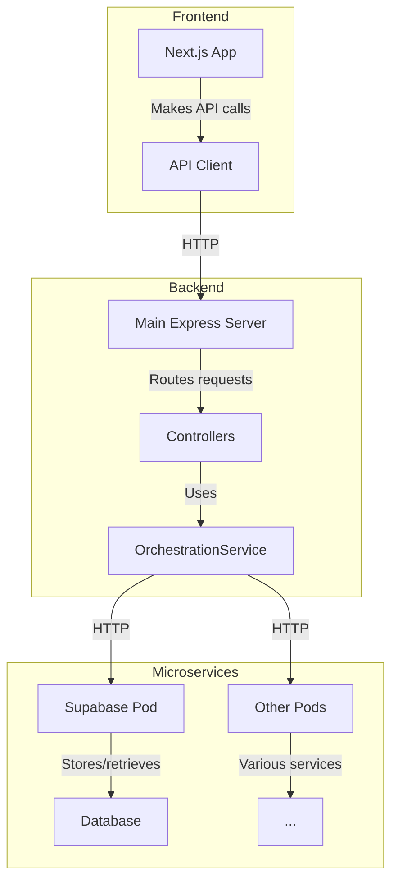

# Tour Browsing API Connectivity

This document explains the API connectivity setup for the Tour Browsing feature, including the route implementation needed to support the frontend tour listing functionality.

## Issue Overview

When implementing the Tour Browsing feature, the frontend was configured to request tours from the `/api/v1/tours` endpoint, but this endpoint was not fully implemented in the backend. 

Error received:
```
{"error":{"code":"NOT_FOUND","message":"Route not found: GET /api/v1/tours"}}
```

## Architecture

The Tour Guide App follows a multi-layered architecture:



## The Implementation Gap

The issue was caused by a missing implementation in the backend routes:

1. **Frontend API Client**
   - The `listTours()` function makes a GET request to `/api/v1/tours`
   
2. **Backend Routes**
   - Only had routes for:
     - `POST /api/v1/tours/generate` - Generate a new tour
     - `GET /api/v1/tours/:id` - Get a single tour by ID
   - Missing: `GET /api/v1/tours` endpoint for listing tours

3. **Supabase Pod**
   - Already had a route at `/tours` for listing tours
   - But this was not connected to the main backend API

## Solution

The fix involved implementing the missing `/api/v1/tours` route in the backend:

1. Added `listTours` controller function in `backend/src/api/controllers/tours.ts`
   - This controller forwards requests to the Supabase pod
   - Supports filtering by `city`, `theme`, `language`, etc.

2. Updated routes in `backend/src/api/routes/tours.ts` to include:
   ```javascript
   router.get('/', listTours);
   ```

3. Added a getter method in `OrchestrationService` to expose the Supabase service URL:
   ```javascript
   getSupabaseServiceUrl(): string {
     return this.supabaseServiceUrl;
   }
   ```

## Complete Data Flow

With the fix in place, the tour browsing data flows as follows:

1. **Frontend** makes a GET request to `/api/v1/tours` (with optional query parameters)
2. **Backend** routes the request to the `listTours` controller
3. **Controller** forwards the request to the Supabase pod's `/tours` endpoint
4. **Supabase Pod** queries the database and returns tours data
5. **Backend** forwards the response back to the frontend 
6. **Frontend** displays the tours in the UI

## Lessons Learned

1. **API Consistency**: When adding a new feature that requires API interaction, ensure that all required endpoints are implemented on both frontend and backend.

2. **Layered Testing**: Test API routes at each layer of the architecture to identify gaps before they cause issues in the UI.

3. **Connectivity Documentation**: Maintain documentation that explicitly maps frontend API calls to their backend implementations.
