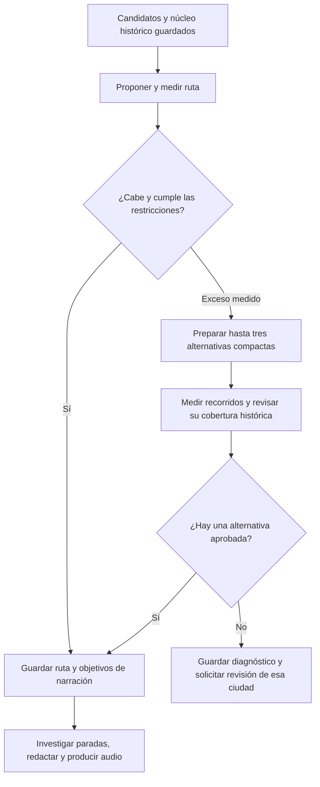

# Plan: replantear rutas históricas que exceden la duración

Fecha: 20 de septiembre de 2026. Estado: implementado y activado para los nuevos
intentos del lote local europeo; la política anterior sigue siendo el valor por
defecto fuera de ese lote.

## Resultado de implementación

La capa `NarrativeRoutePlanningV8.ts` conserva los requisitos protegidos, prueba
primero otro orden con el mismo núcleo cuando hace falta y solo después propone
ámbitos reducidos. Reutiliza los tramos consultados y limita las alternativas y
el trabajo adicional. `NarrativeRouteScopeReviewV8.ts` revisa las alternativas en
tres permutaciones con el proveedor existente y exige motivos y evidencia para
cada exclusión. El checkpoint y el blueprint conservan la decisión, cobertura y
política; los materiales y la página local muestran el ámbito cuando cambia.

El núcleo original se reutiliza desde su artefacto guardado, con ruta y SHA-256
en `planningInputs`. Se comprueba la huella antes de reproducir la auditoría; los
registros de consumo y las respuestas originales permanecen fuera del checkpoint.
Por tanto, la reanudación necesita conservar ese archivo además del checkpoint.

En la primera ejecución, Roma encontró ocho paradas y 125 minutos con su núcleo
completo y pasó a investigación; no necesitó excluir requisitos. Una medición
separada del caso de París encontró dos alternativas de 109 y 119 minutos. Esa
comprobación solo mide: no constituye aprobación editorial y no cambia la ruta
manual de siete paradas y 114 minutos que el usuario ya aprobó.

También se corrigieron las incidencias independientes observadas durante el lote:
el lector acepta secuencias de objetos JSON completos, validando todas las piezas;
si una revisión conjunta falla, hay una recuperación persistida por parada con
el contexto del recorrido. París completó la revisión usando respuestas guardadas,
sin nuevas llamadas. Al reanudar investigación se reconstruyen los controles de
evidencia de las paradas ya suficientes antes de reutilizarlas.

Las pruebas nuevas cubren conservación de requisitos, consenso, evidencia,
geometría, umbrales, plazo de consultas y checkpoints. Pasaron 137 pruebas en cinco
suites de selección, planificación, checkpoint y blueprint, dos pruebas del lector
y la recuperación editorial, y la comprobación TypeScript del generador. El texto siguiente conserva las decisiones y criterios
del plan; la validación humana de los tours terminados sigue pendiente.

## Objetivo y caso de referencia

Conseguir que el generador encuentre un recorrido histórico coherente y caminable
cuando los lugares inicialmente considerados imprescindibles no caben en el tiempo
solicitado. La selección debe terminar antes de investigar en profundidad las
paradas, redactar el guion y producir audio.

París es el caso reproducible: cinco lugares obligatorios dieron una estimación de
194 minutos para una petición de 120, un exceso de 74 minutos. El tramo de Invalides
a Père-Lachaise suponía unos 100 minutos a pie. El usuario aprobó después siete
paradas por Île de la Cité, Louvre e Invalides, medidas en 114 minutos. Esa ruta ya
está en preparación; este plan se refiere a la solución general.

Los datos de referencia están guardados en
`backend/tmp/pilot-batch-europe-20260920/paris/route-approval.json`,
`compact-route-proposals.json` y `approved-compact-route-checkpoint.json` dentro de
ese mismo directorio. Los datos mínimos necesarios para las pruebas se copiarán
a una fixture controlada: las pruebas no dependerán de archivos temporales.

## Diagnóstico confirmado

La auditoría de `EditorialCoreResolverV6.ts` recibe relevancia histórica y duración,
pero no coordenadas ni tiempos de desplazamiento. Clasifica lugares como
obligatorios para el producto de ciudad completo.

`EssentialRouteSelectionV8.ts` conserva todos esos obligatorios.
`NarrativeWalkingPlanV8.ts` prueba otros tamaños, algunas sustituciones opcionales
y otros órdenes. Finalmente mide los desplazamientos, pero no puede revisar el
conjunto obligatorio. El canary bloquea la ruta antes de investigar sus paradas.

La protección es deliberada: evita que un icono como Sagrada Família desaparezca
por existir otro monumento más cercano. La corrección debe añadir una decisión
editorial sobre el ámbito del paseo, por encima del selector estricto. No basta
con convertir en opcional el lugar más lejano.

Hay además dos umbrales actuales: `within_target` significa ±10 %, pero el bloqueo
por exceso se activa por encima de +15 %. Para 120 minutos, 133–138 pueden aparecer
como caminables aunque su ajuste sea `long`. La nueva política debe tratar ese
intervalo explícitamente.

## Decisiones de comportamiento

1. **Mantener la duración solicitada y el modo a pie.** Para 120 minutos, aceptar
   automáticamente una ruta ajustada entre 108 y 132 minutos. La estimación real
   se muestra siempre. No ampliar la petición ni introducir un traslado para
   hacer encajar la ruta.
2. **Separar tres conceptos:** núcleo histórico de la ciudad, imprescindibles del
   ámbito concreto del paseo y lugares fijados expresamente por el usuario.
   Conservar el núcleo original y sus motivos incluso cuando se apruebe otro
   ámbito.
3. **Proteger identidades concretas.** Las elecciones explícitas del usuario y
   las restricciones de una aprobación manual no se modifican automáticamente.
   Los requisitos `city_defining` se protegen también en esta primera versión.
   Otros requisitos sugeridos por el modelo solo podrán excluirse mediante una
   nueva decisión editorial que justifique el cambio de ámbito.
4. **Nombrar con honestidad el recorrido.** Si se limita a una zona, ese ámbito
   debe llegar al título, bienvenida y descripción. No presentar como cobertura
   completa de la ciudad un paseo que deliberadamente deja fuera capítulos.
5. **Revisar antes de producir.** Una ruta nueva cambia la huella del recorrido,
   sus objetivos de narración y los materiales posteriores. No reutilizar un
   guion o audio de otro conjunto u orden de paradas.

Estas decisiones amplían la propuesta V8 de mantener imprescindibles exactos:
el selector sigue cumpliéndola dentro del ámbito aprobado. La nueva capa conserva
y explica cualquier diferencia con el núcleo original de ciudad.

La protección inicial de `city_defining` es una decisión conservadora de producto,
no una atribución de autoridad humana al modelo. En el núcleo aprobado de París,
esa categoría corresponde a Notre-Dame, Louvre e Invalides; Père-Lachaise figura
como `first_visit_expectation`, por lo que esta política permite corregir el caso
observado. Si todos los lugares que impiden un paseo viable son `city_defining`,
esta primera versión requiere revisión del ámbito; no promete resolver ese caso
automáticamente.

## Flujo propuesto

### 1. Detectar y explicar el problema

Reutilizar el planificador actual como primer intento. Si entrega una ruta
medida, caminable y `within_target`, continuar sin auditorías nuevas. Si termina
en `long` o `guided_duration_infeasible`, activar la recuperación.

Guardar duración solicitada y estimada, minutos por tramo, lugares obligatorios,
origen de cada obligación y ajustes ya intentados. Las coordenadas permiten
priorizar alternativas baratas de explorar; no demuestran por sí solas la
viabilidad ni sustituyen los tiempos peatonales reales.

Un fallo del proveedor de rutas, un QID ausente o un desacuerdo sobre el núcleo
no son pruebas de exceso: conservan su diagnóstico y no autorizan exclusiones.
Las rutas demasiado cortas mantienen el ajuste de opcionales existente; esta
recuperación se concentra en el exceso de duración.

El diagnóstico debe conservar los intentos medidos, no solo el candidato final.
Actualmente la comparación por cercanía a la duración puede preferir 140 minutos
inviables frente a 90 caminables. En la nueva política, primero se prioriza
viabilidad y después ajuste, manteniendo la etiqueta de ruta corta. Si no existe
una propuesta ajustada y hay intentos medidos demasiado largos, la recuperación
puede explorar otros ámbitos sin declarar imposible un núcleo que sí cabe.

### 2. Proponer alternativas acotadas

Construir hasta tres propuestas diferentes a partir de los candidatos ya
seleccionados y verificados. Cada una conserva los lugares protegidos y explora
un entorno compacto alrededor de ellos y de los anclajes históricos principales.
Cuando no haya lugares protegidos, los anclajes se obtienen del núcleo y las
señales de relevancia existentes, con desempates deterministas por QID.

Mantener los límites de paradas del producto. Preferir contribuciones históricas
distintas y evitar paradas equivalentes que solo añadan minutos. No introducir
listas especiales de ciudades ni codificar la ruta de París como regla general.
Si ningún ámbito contiene los lugares protegidos y cabe en el tiempo, terminar
con una explicación de la incompatibilidad.

Medir las propuestas con el servicio peatonal existente y reutilizar cada tramo
consultado durante el intento y su recuperación. La clave debe incluir origen,
destino, coordenadas y perfil; A→B no se presume igual a B→A. Evitar una matriz
completa entre todos los candidatos. Compartir una única instancia del servicio
de rutas, cuya caché actual ya distingue el orden de las coordenadas.

Límites iniciales para el piloto: tres propuestas; como máximo 60 solicitudes
peatonales adicionales al proveedor, excluyendo aciertos de caché y contando
reintentos, y 120 segundos para iniciar nuevas solicitudes de esa medición.
El tramo en curso conserva el timeout actual de ocho segundos; no se oculta ese
margen al medir la duración de la recuperación. Estos límites se comparten entre
todas las propuestas. Son límites de trabajo, no promesas de latencia. Si se agotan, conservar lo
obtenido y explicar que la búsqueda quedó limitada, sin afirmar que no existe
ninguna ruta posible.

### 3. Revisar el ámbito y los imprescindibles

El revisor recibe las propuestas completas con orden, tiempos medidos, núcleo
original, requisitos protegidos, evidencia disponible y lista explícita de
omisiones. Puede aprobar una propuesta o rechazar todas. No puede inventar
paradas, cambiar tiempos ni dar por visitado un QID mediante otro cercano.

Para cada antiguo requisito omitido debe explicar qué parte de la historia queda
fuera y por qué encaja con el ámbito propuesto. Mantener variedad y relevancia;
una ruta corta por sí sola no basta. Los motivos deben referenciar evidencia
propia de los candidatos. Un barrio o ámbito geográfico no respaldado por los
datos se describe mediante sus anclajes, sin inventar límites administrativos.

Usar una única ronda de revisión con las tres permutaciones del mecanismo actual
de consenso, incluyendo el orden de las propuestas. Exigir acuerdo sobre la
propuesta y los requisitos finales; un desacuerdo requiere revisión. No iniciar
rondas sucesivas hasta conseguir aprobación. Se conserva la política limitada
de reintentos del proveedor y el presupuesto restante del intento, incluido el
gasto anterior al reanudar.

Validar determinísticamente la propuesta ganadora contra sus mediciones y las
restricciones. El modelo aprueba el ámbito; el código decide si cumple el tiempo,
las identidades y el modo de desplazamiento.

Antes de aceptarla, alinear siempre la selección, las posiciones, las paradas
geométricas y sus tramos con un único orden. Hoy el orden del selector puede
diferir del geométrico cuando el refinamiento no cambia la ruta; no trasladar
esa ambigüedad a las nuevas decisiones ni a sus huellas.

### 4. Guardar la decisión y continuar

Persistir un bloque versionado `routePlanning` con núcleo original, requisitos
protegidos y su procedencia, ámbito final, alternativas medidas, exclusiones y
motivos, política aplicada, fuentes, huellas y gasto. Registrar por separado
cobertura del núcleo de ciudad y cobertura del ámbito: no poner ambas a 100 %
tras eliminar un requisito.

Guardar también las señales de relevancia y decisiones previas necesarias para
reanudar sin repetir su adquisición. Conservar el checkpoint fuente y crear uno
nuevo. Una reanudación de investigación mantiene la ruta aprobada; una
reanudación de selección puede recalcularla con la política elegida, invalidando
los materiales posteriores.

Recalcular los objetivos de narración después de cerrar la ruta. Mantener el
rango actual de 2–5 minutos por parada cuando se asigna el presupuesto normal;
si la caminata impide reservar el mínimo, la propuesta no sirve. No acortar los
audios para disimular el exceso de desplazamiento.

Los siete minutos por parada del cálculo actual son una estimación de estancia,
no audio medido. Se conservará esa distinción y se evitará sumar dos veces la
misma estancia. La duración del audio terminado se informa por separado.

## Implementación por entregas

| Entrega | Cambio concreto | Comprobación para cerrarla |
| --- | --- | --- |
| 1. Contrato y reproducción | Fixture del fallo de París; política y decisión de ámbito versionadas; restricciones del usuario representadas explícitamente | Reproduce el exceso y distingue núcleo de ciudad, ámbito y elecciones manuales |
| 2. Recuperación | Nueva capa `NarrativeRoutePlanningV8.ts` sobre el selector y planificador existentes; propuestas, caché de tramos, límites y revisión editorial | Encuentra alternativas medidas o devuelve un motivo preciso conservando las restricciones |
| 3. Integración | Invocación común desde las ramas nueva y reanudada de `narrative-user-canary-v8.ts`; checkpoint, blueprint y materiales reciben ámbito y procedencia | El cambio de ruta invalida materiales incompatibles y la reanudación conserva los válidos |
| 4. Piloto y activación | Comparación con datos guardados, piloto limitado y activación para nuevos intentos | París recuperable, rutas válidas sin regresiones y coste adicional dentro del límite |

Los contratos V6 y su replay permanecen legibles. El nuevo contexto de revisión
de ámbito pertenece a V8; no se añadirá a escondidas a la auditoría V6 ni se
etiquetará como aprobación humana una decisión automática.

`NarrativeUserCanaryCheckpointV8.ts` valida estrictamente el contenido de `core`:
la información nueva irá en un bloque propio con validación y huella. Los
checkpoints antiguos seguirán siendo legibles; si carecen de procedencia no se
deducirá permiso para modificar requisitos manuales.

`TourBlueprint.ts` fija actualmente `routePolicy: walking-v8-1` en la clave de
caché. La nueva política tendrá versión propia en la petición, checkpoint y clave
del blueprint. El bloque normalizado de ámbito formará parte de su huella y
llegará a los materiales del escritor. Un intento antiguo no adoptará otra
política solo porque cambie la configuración global.

La activación empezará deshabilitada por defecto. Primero se validará con París,
Berlín y una ciudad española compacta con datos disponibles; después se habilitará
para nuevos intentos del lote. No requiere interrumpir la generación actual ni
regenerar entregas ya aprobadas.

## Pruebas y criterios de aceptación

- **París reproducible:** el intento original sigue mostrando 194 minutos; la
  recuperación puede elegir un recorrido histórico medido entre 108 y 132. No se
  exige memorizar las siete paradas manuales ni prometer 114 con datos futuros.
- **Ruta que ya funciona:** mantiene selección y comportamiento, sin llamadas
  editoriales adicionales de recuperación.
- **Icono alejado:** un monumento protegido no desaparece por otro más cercano;
  una parada vecina no satisface su QID. Un núcleo inviable formado únicamente
  por requisitos `city_defining` sigue la salida de revisión descrita.
- **Decisión del usuario:** una parada u orden fijados se respetan; si no caben,
  se informa la incompatibilidad. La ruta manual aprobada de París se conserva.
- **Exclusión editorial:** un requisito del modelo solo sale mediante una
  decisión válida de ámbito, con evidencia y motivo registrado. Cobertura de
  ciudad y de ámbito pueden ser distintas.
- **Umbrales:** para 120 minutos comprobar 108, 132, 133, 138 y 139, incluidos
  redondeos; caminar más no puede compensarse entregando narraciones mínimas
  insuficientes.
- **Datos y fallos:** rutas incompletas, proveedor caído, tiempos inválidos o
  estimación geométrica no se convierten en una alternativa medida aprobada.
  No se introduce `self_transfer` durante esta recuperación. Rechazar QID
  duplicados y coordenadas inválidas; comprobar el número real de paradas aunque
  el conjunto obligatorio supere el tamaño solicitado al selector.
- **Orden y estabilidad:** permutar los candidatos no altera los desempates
  deterministas; las tres permutaciones editoriales deben coincidir para aprobar.
  El orden de ruta, geometría y huellas coincide también cuando no hay refinamiento.
- **Coste acotado:** no se repiten consultas de tramos idénticos, se distinguen
  direcciones, se cumplen límites de propuestas, tiempo y gasto, y no se repite
  toda la descarga de candidatos al cambiar de ámbito.
- **Recuperación:** una cancelación guarda el avance; reanudar conserva gasto,
  política, ámbito y huellas, y rechaza mezclar guiones o audio de rutas distintas.
- **Sin alternativa:** deja diagnóstico y candidatos disponibles y permite que
  la cola continúe con otras ciudades; no publica el tour como terminado.

Reutilizar y ampliar las suites de selección esencial, planificación peatonal,
duración, checkpoint y blueprint. Las regresiones de rutas usan servicios
simulados y tiempos capturados; el piloto real mide latencia, solicitudes,
gasto y resultado editorial por separado. No se presupone un ahorro porcentual.

La entrega termina cuando el caso de exceso puede recuperarse bajo estas reglas,
las rutas válidas mantienen su comportamiento y un caso incompatible conserva
un diagnóstico comprensible antes de gastar en investigación, guion y audio.
