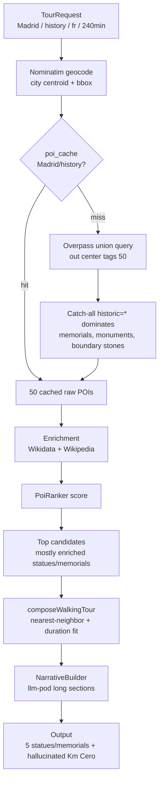

# 20 - Madrid History Tour Postmortem

Date: `2026-05-24`

Tour: `Madrid / history / fr / 240 minutes`

Result: 6 stops, 5 of them statues or memorials, plus one hallucinated `Kilómetro Cero` narration.

## Summary

The generated Madrid history tour did not match the expected product quality. It selected mostly commemorative statues/memorials instead of iconic historic landmarks such as Palacio Real, Plaza Mayor, Catedral de la Almudena, Museo del Prado, Templo de Debod, Puerta de Alcalá, Gran Vía, or Puerta del Sol.

Selected stops:

| Position | Name | Score | OSM signals |
|---:|---|---:|---|
| 0 | Estatua de Federico García Lorca | 9.83 | `historic=memorial`, `tourism=artwork`, Wikidata, Wikipedia |
| 1 | Monumento en honor a los abogados de Atocha | 8.70 | `historic=memorial`, Wikidata, Wikipedia |
| 2 | Estatua a Miguel de Cervantes Saavedra | 10.70 | `historic=memorial`, `tourism=artwork`, Wikidata, Wikipedia |
| 3 | Monumento a los Caídos por España | 10.55 | `historic=monument`, Wikidata, Wikipedia |
| 4 | Monumento a Claudio Moyano | 9.34 | `historic=memorial`, `tourism=artwork`, Wikidata, Wikipedia |
| 5 | Kilómetro Cero | 4.98 | `historic=memorial`, Wikipedia only |

The final stop, `Kilómetro Cero`, also produced incorrect narration: it referenced Argentina and the Dominican Republic instead of Madrid, and one section drifted into Spanish despite the requested tour language being French.

## Candidate Pool

The Madrid/history Overpass cache contained exactly 50 POIs, matching the hard Overpass output limit currently used by the backend.

Composition by `historic` tag:

```text
historic=memorial       ####################### 23 (46%)
historic=monument       ###############         15 (30%)
historic=boundary_stone ######                   6 (12%)
historic=yes            ##                       2 (4%)
historic=ruins          #                        1 (2%)
historic=wayside_cross  #                        1 (2%)
unnamed/no useful type   ##                       2 (4%)
```

Coverage by enrichment signal:

```text
Wikidata + Wikipedia    ##########              10 (20%)
Wikidata only           ####                     4 (8%)
Wikipedia only          ##                       2 (4%)
Neither                 ################################## 34 (68%)
```

Important missing landmarks:

| Landmark | Expected why | In pool? |
|---|---|---|
| Palacio Real | iconic historic palace, attraction | No |
| Plaza Mayor | iconic historic square | No |
| Catedral de la Almudena | cathedral | No |
| Museo del Prado | major historic/cultural landmark | No |
| Templo de Debod | ancient monument/attraction | No |
| Puerta de Alcalá | iconic historic monument/attraction | No |
| Puerta del Sol / Gran Vía | iconic city landmarks | No, except `Kilómetro Cero` marker |

## Root Causes

### RC-1: Catch-all `historic=*` dominates the 50-result Overpass cap

Files:
- `backend/src/domain/poi/themeTags.ts`
- `backend/src/infrastructure/poi/OverpassPoiFetcher.ts`

The history theme includes specific filters for palaces, castles, cathedrals, and historic attractions. However, it also includes broad catch-all filters:

```text
node["historic"]
way["historic"]
relation["historic"]
```

In Madrid, `historic=*` mostly returns memorials, statues, boundary stones, and minor commemorative markers. Because the Overpass query uses `out center tags 50`, the first 50 results are filled before many iconic building/attraction candidates can enter the pool.

This means N-4.1's additive filters were not enough: they expanded the query, but the generic catch-all still floods the result cap.

### RC-2: Ranking can only rank the pool it receives

File: `backend/src/services/poi/PoiRanker.ts`

The ranker now rewards richer Wikipedia/Wikidata and historic building categories, but Palacio Real and other iconic landmarks were absent from the 50-POI pool. Ranking improvements cannot rescue POIs that never reach enrichment.

There is also dead scoring code:

```typescript
if (wikipediaBody.length > 5000) score += 3;
```

`WikipediaEnricher.ts` truncates article bodies to 2000 characters, so the `> 5000` branch is unreachable.

### RC-3: Cache can preserve a bad pool

File: `backend/src/infrastructure/postgres/PostgresPoiCacheRepository.ts`

`poi_cache` is keyed by `(city, theme)` and has a 30-day TTL. A bad Madrid/history result can survive code changes until the cache is deleted or expires.

### RC-4: Narration validation missed wrong-city and wrong-language drift

File: `pods/llm-pod/src/routes/narrativeLong.ts`

`Kilómetro Cero` appears to have thin/ambiguous seed data. The validator caught neither:

- Spanish text in a French tour.
- References to Argentina and the Dominican Republic.

The current language check mainly catches English drift, not Spanish/Italian/German drift into French. The geography drift list is narrow and does not cover common country/city hallucinations.

## Pipeline Diagram



## Recommended Fixes

### Priority 1: Fix candidate harvesting

Change broad history catch-all filters from any `historic=*` to historic POIs with notability signals:

```text
node["historic"]["wikidata"]
way["historic"]["wikidata"]
relation["historic"]["wikidata"]
node["historic"]["wikipedia"]
way["historic"]["wikipedia"]
relation["historic"]["wikipedia"]
```

Also add non-historic-tag landmark filters for major attractions/buildings that often lack `historic=*`:

```text
tourism=attraction with wikidata/wikipedia
tourism=museum with wikidata/wikipedia
building=cathedral|palace|castle with wikidata/wikipedia
```

Then purge `Madrid/history` from `poi_cache` to force a fresh Overpass query.

### Priority 2: Fix ranking dead code

Replace the impossible `wikipediaBody > 5000` branch with thresholds compatible with the current 2000-character extraction cap.

### Priority 3: Fix narration drift validation

Detect non-target Romance language drift and broader country/city drift for thin-seed sections.

## Validation Plan

1. Delete `Madrid/history` from `poi_cache`.
2. Generate or inspect a fresh Madrid/history candidate pool.
3. Confirm the pool includes at least three landmarks/buildings/attractions.
4. Confirm final stops include fewer memorial/statue-only POIs.
5. Confirm `Kilómetro Cero`, if selected, narrates Madrid in French.
6. Run backend and llm-pod builds.

## Implementation Status

Implemented 2026-05-24:

- `themeTags.ts`: added prioritized history groups and moved broad `historic=*` fallback behind Wikidata/Wikipedia requirements.
- `OverpassPoiFetcher.ts`: added priority-group fetching, dedupe, low-value filtering, and a 150-POI cap for prioritized themes.
- `PostgresPoiCacheRepository.ts`: development cache TTL reduced to 1 hour; production remains 30 days.
- `PoiRanker.ts`: removed unreachable `wikipediaBody > 5000` bonus, added compatible length thresholds, strengthened landmark/building bonuses, and penalized memorial/artwork/aircraft POIs.
- `narrativeLong.ts`: strengthened wrong-language detection across supported languages and added drift terms that caught the observed Kilómetro Cero hallucination.
- Madrid/history cache was purged.

Validation:

- `npm run build` in `backend` passed.
- `npm run build` in `pods/llm-pod` passed.
- Fresh Madrid/history Overpass check returned 150 prioritized POIs and confirmed these are present: Palacio Real, Palacio Real de Madrid, Catedral de la Almudena, Puerta de Alcalá, Puerta del Sol, Plaza Mayor, Museo de Historia de Madrid.
- Simplified local ranking check placed landmark/building candidates above statue/memorial candidates.

Remaining limitation:

- A full end-to-end tour generation with narration and audio still needs runtime validation because it is expensive and depends on external services plus local LLM/TTS pods.

Update 2026-05-29:

- A later live runtime validation changed the bottleneck again. The history pool and shortlist are materially better now, but a `Madrid/history/es/240` run still produced a weak first-visit tour product: 6 final stops, estimated 71 minutes, `coverageRatio ~= 0.297`, degraded route.
- Selected route: Plaza de las Descalzas, Palacio Gaviria, Mercado de San Miguel, Catedral Castrense, Plaza del Alamillo, Plaza de la Paja.
- Interpretation: the main open problem is no longer candidate harvesting alone. The next priority is route composition for long landmark-rich city tours.
