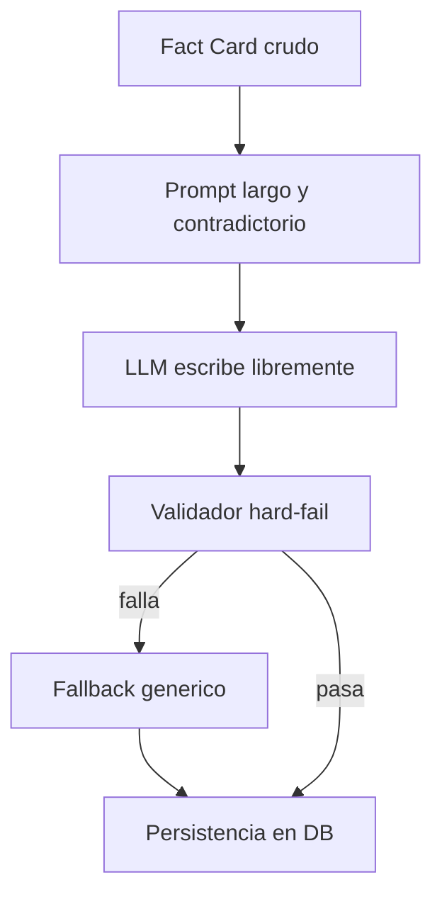
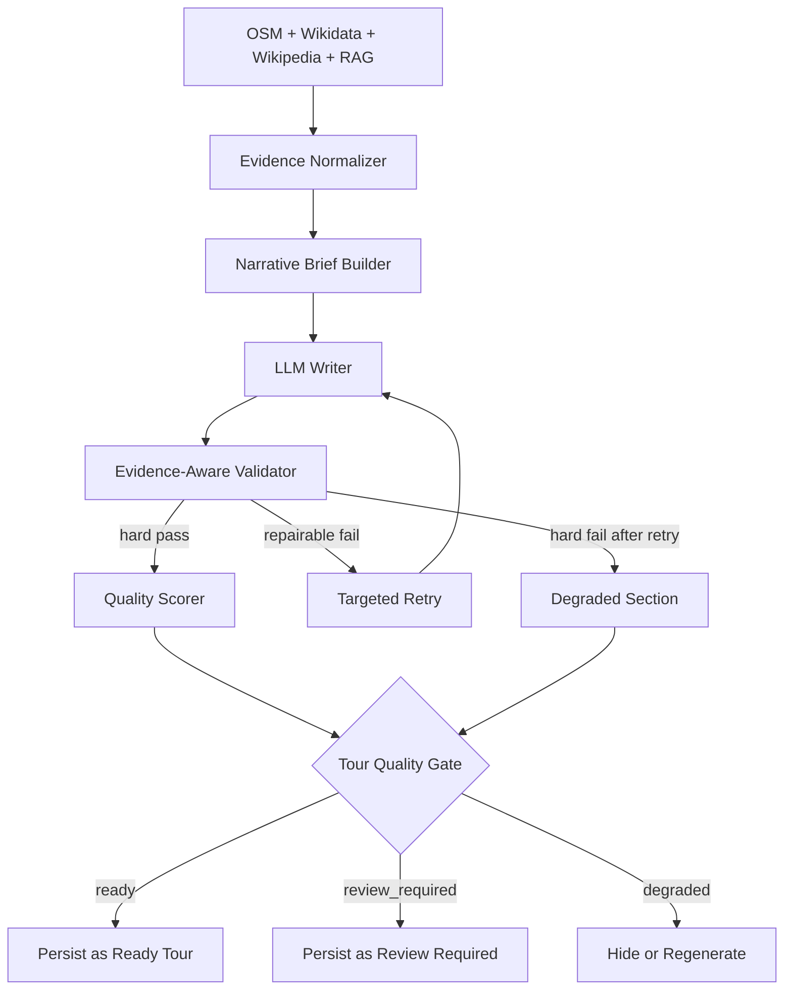

# 40 — Plan Final de Recuperacion de Calidad Narrativa

**Date:** 2026-06-10
**Status:** Draft for approval
**Scope:** Backend + llm-pod + quality gate + persistence

---

## Objetivo

Recuperar la calidad de la narracion generada para que el producto entregue una audioguia que:

- suene a guia real;
- se sienta natural y rica;
- siga anclada a hechos verificables;
- no dependa de fallback generico como contenido final.

Este plan no busca solo bajar el `fallback rate`. Busca cambiar el sistema para que la narracion buena sea el comportamiento normal, y la narracion degradada quede claramente marcada como degradada.

---

## Respuesta de Producto

La meta no es "ver como queda".

La meta es producir narracion vendible y util de verdad.

Eso implica dos reglas:

1. Un POI con evidencia rica debe poder producir una narracion de guia natural, concreta y memorable.
2. Un POI con evidencia pobre no debe rellenarse con prosa bonita inventada; debe salir breve, observacional, o ser sustituido por un POI mejor.

---

## Diagnostico Final

El problema no es solo el modelo.

El problema actual es una combinacion de arquitectura, validacion y persistencia:

- el LLM recibe evidencia cruda, no un brief narrativo claro;
- los prompts son largos y contradictorios;
- el validador castiga estilo como si fuera alucinacion factual;
- el retry no esta funcionando realmente;
- el fallback degradado se guarda en base de datos como si fuera producto listo.

Bug confirmado de alto impacto:

- en `pods/llm-pod/src/routes/narrativeLong.ts`, `generateSection()` usa `for (let attempt = 0; attempt < 1; attempt++)`, lo que deja el retry practicamente muerto.

Otros problemas estructurales detectados:

- `MODEL_VERSION` sigue hardcoded con `llama3.1:8b-long-v5` aunque el sistema actual habla de `qwen2.5:14b`;
- el cache de narracion puede dar diagnosticos enganados o servir contenido debil bajo una identidad de modelo equivocada;
- el ban list sigue hard-failando frases o palabras que en realidad deberian depender de evidencia;
- el sistema genera muchas requests concurrentes contra Ollama local, lo que puede degradar consistencia y latencia;
- el fallback actual contiene meta-comentarios y en algunos casos frases que el propio sistema banea en otras rutas.

---

## Diagrama Del Problema Actual



### Consecuencia

- el generador y el validador compiten entre si;
- el sistema optimiza para "no fallar factualmente" pero no para sonar como guia;
- cuando falla, el producto final sigue saliendo a DB y puede llegar a UI o audio.

---

## Arquitectura Objetivo



### Cambio Clave

El LLM deja de improvisar desde evidencia cruda y pasa a redactar desde un `NarrativeBrief` deterministico.

---

## Principios Del Nuevo Sistema

1. **Evidence first**
   La narracion se construye desde hechos permitidos, no desde atmosfera generica.

2. **Style from facts**
   La riqueza sale de relacionar bien los datos, no de adjetivar sin soporte.

3. **Fallback is not product**
   El fallback puede existir como degradacion tecnica, pero no como contenido listo para vender.

4. **Thin seeds require honesty**
   Si el POI tiene poca evidencia, la narracion debe ser breve y observacional, o el POI debe salir de la ruta.

5. **Soft-style scoring, hard factual validation**
   No todo problema de estilo debe disparar fallback. Hay que separar estilo malo de claim inventado.

6. **Measure before tuning**
   Ningun ajuste de prompts o bans debe entrar sin baseline y sin comparacion antes/despues.

---

## Fase 0 — Auditoria Real

### Objetivo

Dejar de adivinar y medir el dano real en tours recientes y caches actuales.

### Trabajo

- auditar tours recientes en DB en modo read-only;
- calcular `fallbackRate` por seccion y por tour;
- listar `fallbackReasons` mas frecuentes;
- detectar tours con >50% de secciones fallback;
- detectar textos persistidos con meta-comentarios internos;
- revisar `poi_narration_cache` contra modelo real;
- revisar que ciudades realmente corren con RAG y cuales no;
- agrupar POIs por riqueza de seeds: rich, medium, thin.

### Salidas

- reporte baseline con metricas reales;
- lista de tours malos ya guardados;
- top 10 fallos reales por frecuencia;
- set de 10 fixtures dorados para pruebas posteriores.

### Criterio de salida

No se toca politica editorial ni prompts estructurales hasta tener este baseline.

---

## Fase 1 — Fixes Baratos y Medibles

### Objetivo

Arreglar bugs evidentes y volver observable el sistema antes de redisenar nada.

### Cambios

1. Activar retry real.
2. Corregir `MODEL_VERSION` y alinear cache con el modelo real.
3. Agregar logging estructurado por seccion:
   - razon de fallo;
   - intento 1 vs intento 2;
   - seed quality;
   - modelo;
   - duracion.
4. Limitar concurrencia minima contra Ollama para reducir saturacion.

### Verificacion

- unit test para confirmar que hay exactamente 1 retry cuando corresponde;
- comparar `fallbackRate` antes/despues sin tocar ban list ni policy;
- validar que cache use version de modelo correcta.

### Criterio de salida

- retry activo y medido;
- versionado de modelo consistente;
- baseline actualizado tras los fixes.

---

## Fase 2 — Rúbrica Editorial y Fixtures Dorados

### Objetivo

Definir formalmente que significa "narracion de guia natural y rica".

### Rubrica minima por seccion

Una seccion buena debe cumplir:

- factualidad: sin claims fuera de evidencia;
- concrecion: al menos 1 detalle verificable o visible;
- voz: suena a guia real, no a brochure;
- no meta: no menciona fuentes, limitaciones ni reglas internas;
- utilidad: ayuda al visitante a leer el lugar;
- naturalidad: espanol fluido;
- brevedad: longitud controlada segun seccion.

### Fixtures dorados

Crear 10 casos de prueba:

- monumento rico;
- edificio civico rico;
- iglesia rica;
- plaza media;
- mercado medio;
- POI thin;
- ciudad con RAG;
- ciudad sin RAG;
- tema history;
- tema architecture/art.

Cada fixture debe incluir:

- evidencia de entrada;
- brief esperado;
- ejemplo aceptable;
- ejemplo no aceptable;
- resultado esperado del validador.

### Criterio de salida

No se reescriben prompts grandes sin tener esta referencia editorial.

---

## Fase 3 — Pasar De Bans Planos a Validacion Con Evidencia

### Objetivo

Separar estilo mediocre de alucinacion factual.

### Cambio conceptual

Hoy:

- `fachada dorada` puede fallar siempre.

Objetivo:

- si la evidencia habla de dorado/oro, puede pasar;
- si no hay evidencia, falla como `unsupported-visual-claim`.

### Nuevo esquema de validacion

#### Hard factual fail

- fecha inventada;
- arquitecto inventado;
- estilo inventado;
- evento inventado;
- ubicacion/toponimo inventado.

#### Evidence-aware visual fail

- materiales o colores no soportados;
- interiores no visibles;
- atmosfera sensorial no soportada;
- ceremonias, guardias, lujo o emociones inventadas.

#### Hard meta fail

- mencionar fuentes;
- mencionar limitaciones de registros;
- mencionar hechos verificados o reglas internas.

#### Soft style issue

- prosa demasiado promocional;
- tono brochure;
- palabra fuerte pero no falsa.

#### Hard cliche fail

- frases turisticas formulaicas tipo `hidden gem`, `steeped in history`, etc.

### Resultado esperado

El sistema deja de mandar a fallback secciones rescatables solo por una palabra no ideal.

---

## Fase 4 — NarrativeBrief Deterministico

### Objetivo

Reducir la libertad del LLM a una tarea de redaccion, no de interpretacion desordenada.

### Nuevo contrato interno

```ts
interface NarrativeBrief {
  poiName: string;
  city: string;
  theme: string;
  language: string;
  seedQuality: 'rich' | 'medium' | 'thin';
  allowedFacts: BriefFact[];
  visibleCues: string[];
  localContext: string[];
  forbiddenClaims: string[];
  sectionBeats: {
    arrival: string[];
    history: string[];
    significance: string[];
    transition?: string[];
  };
  tone: 'serious-cultivated' | 'warm-practical' | 'curious-vivid';
}
```

### Reglas

- `allowedFacts`: solo hechos que el LLM puede afirmar;
- `visibleCues`: observaciones seguras del exterior y del entorno;
- `forbiddenClaims`: cosas que no debe mencionar;
- `sectionBeats`: micro-objetivos de cada seccion;
- `tone`: tono controlado por tema y tipo de ruta.

### Beneficio esperado

- menos conflicto en prompts;
- mas naturalidad desde estructura;
- menos necesidad de ban lists enormes;
- mejor comportamiento en thin seeds.

---

## Fase 5 — Retry Inteligente Por Tipo De Error

### Objetivo

Que el segundo intento repare el error real, no rehaga la seccion a ciegas.

### Politica

| Error | Feedback de retry |
|---|---|
| `fact-coverage` | incluir este hecho concreto |
| `unsupported-claim` | elimina esta afirmacion exacta |
| `banned-meta` | no menciones reglas, fuentes o datos limitados |
| `word-count` | reescribe dentro del rango objetivo |
| `style-soft-low` | hazlo mas concreto y menos promocional |

### Regla operativa

- maximo 2 intentos por seccion;
- si falla por claim critico despues de retry, la seccion queda degradada;
- si el fallo es solo de estilo y el texto sigue siendo util y factual, no debe caer a fallback automaticamente.

---

## Fase 6 — Fallback, Persistencia y Gate De Calidad

### Objetivo

Impedir que el fallback generico termine publicado como producto bueno.

### Politica de estados

| Estado | Regla |
|---|---|
| `ready` | 0-10% fallback y sin claims criticos |
| `review_required` | 10-40% fallback o score editorial dudoso |
| `degraded` | >40% fallback o calidad no comercial |
| `blocked` | contradicciones factuales criticas |

### Cambios de persistencia

Guardar metadata por tour y por seccion:

```json
{
  "narrationQuality": {
    "status": "review_required",
    "model": "qwen2.5:14b",
    "promptVersion": "narrative-brief-v1",
    "validatorVersion": "evidence-aware-v1",
    "sections": {
      "arrival": { "status": "generated", "attempts": 1 },
      "history": { "status": "fallback", "reason": "unsupported-claim" }
    }
  }
}
```

### Reglas extra

- no cachear tours all-fallback;
- no vender tours `degraded`;
- no considerar audio completo como senal suficiente de readiness.

---

## Fase 7 — Limpieza De Base De Datos Existente

### Objetivo

Arreglar el dano ya persistido.

### Politica

| Caso | Accion |
|---|---|
| tours con fallback obvio o texto tipo `Visit X` | marcar `degraded` |
| tours con >50% fallback | ocultar de UI |
| tours usados por Flexible Pass | re-evaluar readiness |
| cache con version vieja | invalidar o versionar |
| tours estrategicos | regenerar en batch despues del fix |

### Nota

La limpieza debe ser primero no destructiva: marcar, ocultar y regenerar; borrar solo si luego se decide.

---

## Fase 8 — Rollout Seguro Con Flags

### Flags sugeridos

- `NARRATIVE_RETRY_ENABLED`
- `NARRATIVE_EVIDENCE_BANS_ENABLED`
- `NARRATIVE_BRIEF_ENABLED`
- `NARRATIVE_QUALITY_GATE_MODE`
- `NARRATIVE_MAX_CONCURRENCY`

### Orden de rollout

1. fixtures locales;
2. Madrid con `SKIP_AUDIO=true`;
3. Madrid en varios temas;
4. una ciudad con RAG;
5. una ciudad sin RAG;
6. quality gate en `enforce`.

---

## Riesgos y Decision Gates

### Riesgo 1

`qwen2.5:14b` puede seguir sonando generico incluso con mejor arquitectura.

### Mitigacion

Despues de Fase 4, medir calidad manual y automatica. Si no llega al nivel deseado, abrir decision gate:

- usar modelo mayor local;
- usar API externa para narracion;
- reducir ambicion narrativa por stop;
- reducir numero de secciones por POI.

### Riesgo 2

Thin seeds nunca daran narracion rica.

### Mitigacion

No forzar riqueza donde no hay evidencia. Mejor salida:

- narracion breve y honesta;
- o sustituir el POI.

### Riesgo 3

Reducir concurrencia puede subir latencia.

### Mitigacion

Medir p50/p95 y ajustar limite, no serializar todo sin necesidad.

---

## Criterios De Exito

| Metrica | Target |
|---|---|
| fallback rate por seccion | <10-15% |
| tours publicados con >50% fallback | 0 |
| claims criticos contradichos | 0 |
| meta-comentarios en texto final | 0 |
| narraciones cacheadas con version incorrecta | 0 |
| fixtures aceptables en review manual | >=8/10 |
| sample manual Madrid | >=4/5 stops buenos |
| Flexible Pass con tours malos | 0 |

---

## Orden Recomendado De Implementacion

| Orden | Fase | Estimacion |
|---|---|---|
| 1 | Auditoria DB y fixtures | 0.5-1 dia |
| 2 | Retry real + model version + logging | 0.5 dia |
| 3 | Medicion antes/despues | 0.5 dia |
| 4 | Rubrica editorial + fixtures dorados | 1 dia |
| 5 | Validacion evidence-aware | 1-2 dias |
| 6 | Fallback/persistencia/gate | 1 dia |
| 7 | NarrativeBrief v1 | 2-4 dias |
| 8 | Concurrency limiter | 1 dia |
| 9 | Cleanup y regeneracion | 1 dia |
| 10 | Rollout controlado | 1 dia |

---

## Recomendacion Final

No hacer otra ronda aislada de prompt tuning.

La estrategia correcta es:

1. medir;
2. arreglar retry/model/cache;
3. separar factualidad de estilo;
4. mover el sistema a `NarrativeBrief`;
5. impedir que fallback generico llegue a DB como contenido listo.

Si despues de eso el modelo local sigue sin sonar como guia real, el problema ya no sera el prompt: sera el limite del modelo para esta tarea, y habra que decidir entre modelo mejor, API externa o una experiencia narrativa menos ambiciosa.
