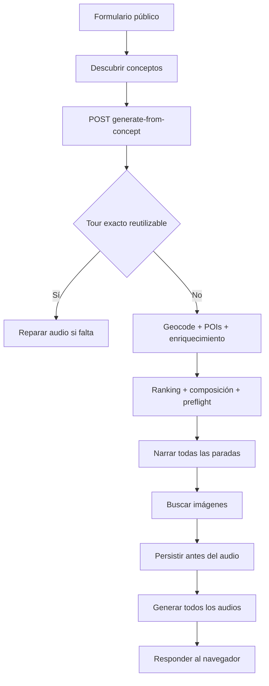
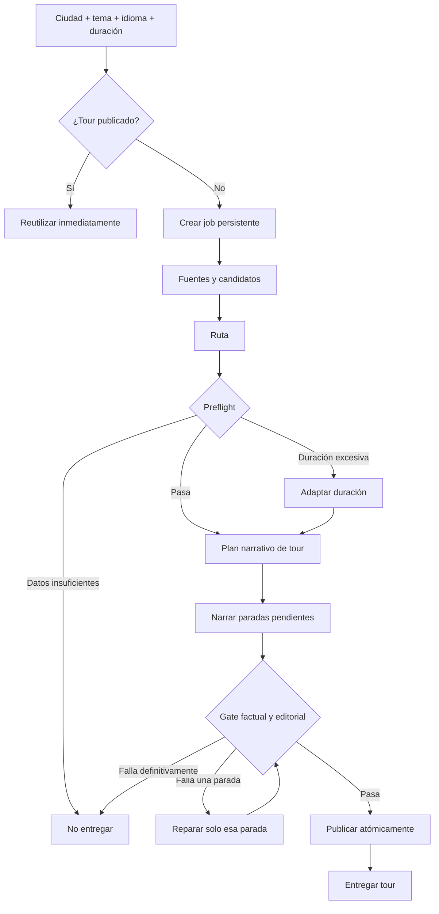

# 51 — Generación textual escalable y voz de guía

Fecha: 2026-08-05  
Estado: implementado (migración pendiente de aplicar por entorno)

## Objetivo

La propuesta central del producto sigue siendo generar un tour cuando todavía no
existe. Madrid/history/es/120 es el caso de calibración, no una lista cerrada de
ciudades. La primera versión fiable se limita a texto: audio y TTS quedan fuera.

Un buen resultado debe sentirse como una persona que acompaña al visitante:

- da una única bienvenida al tour;
- mantiene una pregunta o promesa común;
- dedica una idea diferente a cada parada;
- ayuda a mirar el lugar con detalles concretos;
- evita aperturas, conclusiones y abstracciones repetidas;
- no inventa una identidad humana ni hechos sin evidencia.

## Proceso actual



Problemas observados:

- el navegador espera una operación larga y variable;
- la UI muestra etapas temporizadas, no progreso real;
- un fallo tardío hace difícil continuar desde la última etapa válida;
- `readyOnly` mide longitud, fallbacks y audio, pero no publicación ni calidad
  transversal;
- la bienvenida vive en la primera parada y los prompts de todas las paradas
  compiten por usar las mismas fórmulas de guía;
- el validador trabaja principalmente por sección y no detecta bien ideas,
  aperturas y cierres repetidos entre paradas;
- conceptos especializados añaden una llamada prematura antes de que los temas
  básicos sean fiables;
- el frontend comparte loading/error global entre generación, catálogo y detalle.

## Proceso objetivo



Una petición nueva devuelve `202 Accepted`, un `jobId` y una URL de estado. El
trabajo continúa aunque el usuario recargue o abandone la página. Una petición
equivalente reutiliza un tour publicado o el job activo.

## Estados y checkpoints

Estados terminales: `completed` y `failed`.

Etapas observables:

```text
queued
sourcing
routing
planning_narrative
narrating
validating
repairing
publishing
completed
failed
```

El job conserva en base de datos la petición, estado, progreso, resultado y
diagnóstico. Al reiniciar el backend, los jobs pendientes se reanudan desde su
petición persistida; los caches existentes evitan repetir enriquecimiento y
narraciones válidas. Los fingerprints que determinan reutilización son:

- fuentes: ciudad, idioma y snapshot;
- ruta: candidatos, algoritmo, tema y duración;
- plan: ruta y versión editorial;
- parada: fuentes, rol, contexto, prompt y modelo;
- publicación: ruta, narraciones y auditoría.

Se permiten como máximo dos reparaciones dirigidas por parada. Si el tour sigue
fallando, se conserva el diagnóstico pero no se entrega ni publica.

## Contrato narrativo

### Introducción

`Tour.introduction` contiene entre 100 y 150 palabras y es la única bienvenida:

- ciudad, tema y duración aproximada;
- punto de partida;
- promesa o pregunta del recorrido;
- orientación breve para seguirlo.

Las paradas no vuelven a dar la bienvenida.

### Plan de tour

Antes de redactar se construye un `TourNarrativePlan`:

```text
promise
centralQuestion
narrativeArc
introductionBrief
stopRoles[]
  openingArchetype por parada
  transitionPurpose por parada
closingResolution
```

Madrid/history/es/120 usa como referencia editorial:

| Parada | Función narrativa |
|---|---|
| Palacio Real | Presentar la corte y el poder real |
| Catedral de la Almudena | Relacionar capital, religión e identidad |
| Plaza de la Villa | Recuperar el origen municipal |
| Plaza Mayor | Mostrar comercio, ceremonia y vida pública |
| Puerta del Sol | Explicar el centro cívico y nacional |
| Plaza de Cibeles | Introducir expansión y capital moderna |
| Puerta de Alcalá | Resolver la transformación de ciudad a capital |

La lista es un oracle editorial del fixture, no una entrada del algoritmo general.
El archivo ejecutable de referencia es
`backend/fixtures/oracle/madrid-history-es-120.json`.

### Estado de calibración de Madrid

La auditoría offline del candidato antiguo (`madrid-history-es-candidate.json`,
240 minutos) falla correctamente por repetición transversal, abuso de conectores
como “fíjate/observa” y reutilización de “capas/transformación/identidad”. Ya no se
publicaría.

Al componer 120 minutos con el pool congelado actual, la duración sí encaja
(121,3 min), pero la ruta no alcanza el oracle porque la Catedral de la Almudena
no está en el fixture de candidatos. La siguiente iteración de Madrid debe, por
tanto, corregir captura/canonicalidad antes de gastar tokens en narración; no se
debe compensar con una excepción de Madrid en producción.

### Paradas

- objetivo de 180–260 palabras (el gate tolera 160–420 para no descartar una
  narración factual válida solo por una desviación menor);
- guía local sin nombre, cálida, directa y precisa;
- trato de “tú”;
- detalle visible, contexto sustentado e idea memorable propia;
- transición con propósito, no un anuncio mecánico;
- la última parada resuelve la promesa y no abre otra transición.

## Gate transversal

Son hard fail:

- frases de cinco o más palabras repetidas entre paradas, salvo nombres propios;
- el mismo inicio normalizado en dos paradas;
- conclusiones o transiciones repetidas;
- la misma fórmula de guía más de una vez por parada o más de dos en el tour;
- bienvenida fuera de `introduction`;
- fallback, meta-comentario o contradicción crítica;
- reutilizar la misma abstracción como idea principal en varias paradas;
- menos de 80% de claims verificables confirmados.

La evaluación devuelve `affectedStopIds` e instrucciones de reparación. Solo esas
paradas se regeneran. La publicación requiere score editorial >= 80, ruta no
degradada, duración 85–115%, cero fallos pendientes y contenido completo.

## Frontend

- el selector acepta cualquier ciudad y temas básicos;
- primero busca un tour publicado;
- si no existe, crea un job y navega a `/generation/:jobId`;
- la página consulta progreso real y puede recuperarse tras una recarga;
- al completar redirige al tour publicado;
- no muestra ni ejecuta audio;
- `/dev/tour-preview` permite revisar un JSON local sin generar ni persistir.

Variables del frontend para este flujo:

```text
API_URL=http://localhost:3001/api
API_KEY=<clave del backend, solo servidor>
ENABLE_EDITORIAL_PREVIEW=false
```

`API_KEY` nunca se envía al navegador; los Route Handlers de Next.js actúan como
proxy de catálogo y jobs.

## Iteración rápida

```bash
# Auditoría estructural/factual sin generar
npm run quality:audit -- fixtures/tours/madrid-history-es-candidate.json

# Plan + bienvenida + gate transversal, sin generar
npm run quality:audit:text -- fixtures/tours/madrid-history-es-candidate.json

# Repetir únicamente las paradas 2 y 5 sobre fuentes congeladas
npm run quality:regenerate -- Madrid history es http://localhost:3002 Spain ES --stops=2,5

# Suite offline de composición y calidad
npm run quality:test

# Preview visual de un JSON local
ENABLE_EDITORIAL_PREVIEW=true npm run dev
# abrir /dev/tour-preview
```

| Fallo | Trabajo que se repite |
|---|---|
| selección u orden | ruta offline |
| rol narrativo | plan narrativo |
| texto de una parada | esa parada |
| auditoría transversal | `affectedStopIds` |
| frontend | fixture local |
| proceso interrumpido | job persistido; se reanuda y aprovecha caches válidos |
| fuentes externas | recaptura deliberada |

## Criterios de aceptación

- una ciudad publicada no llama al LLM;
- una ciudad nueva crea un job persistente e idempotente;
- el preflight falla antes de narrar cuando no hay base suficiente;
- existe exactamente una bienvenida;
- repetición transversal provoca reparación dirigida;
- reparar una parada no regenera las demás;
- un fallo final no entrega ni publica;
- un tour aprobado se publica atómicamente y luego se reutiliza;
- la ruta pública de jobs de texto no llama a TTS ni busca imágenes;
- el frontend recupera el progreso real tras recargar;
- los fixtures y pruebas offline siguen siendo el ciclo normal de desarrollo.
