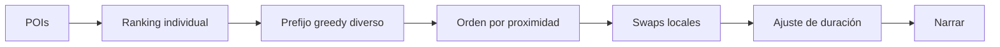
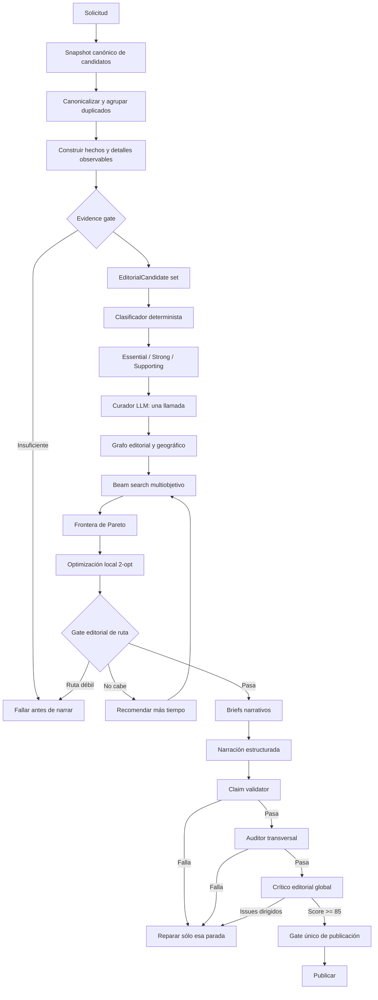
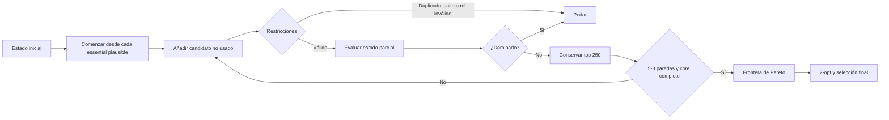
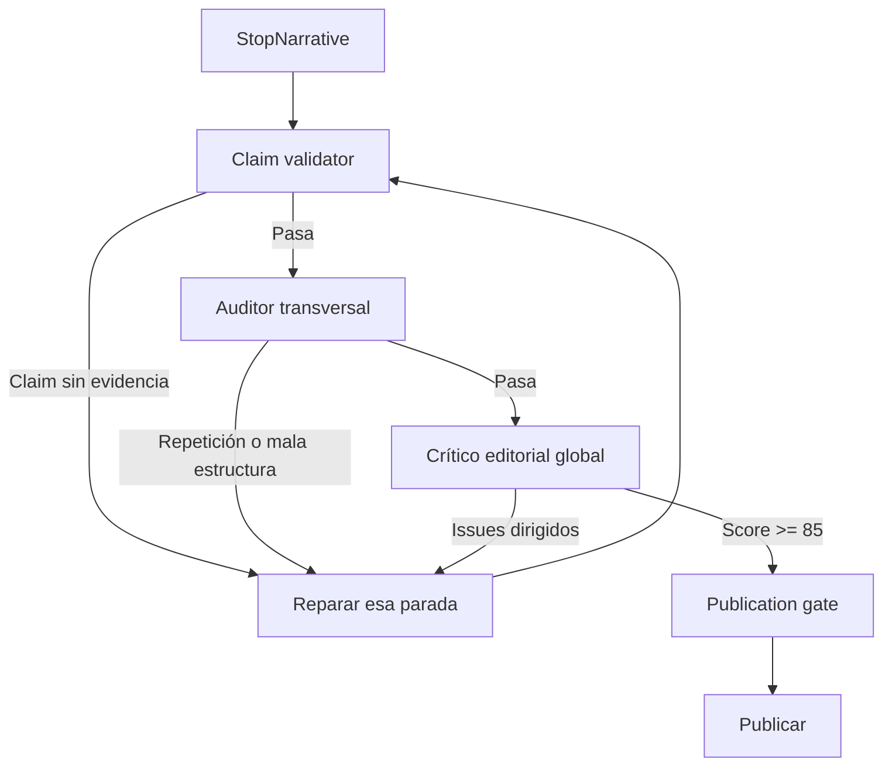
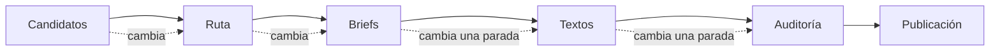

# 52 — Calidad editorial v2 y optimizador de tours

Fecha: 2026-08-06  
Estado: selección offline implementada; generalización pendiente

## Objetivo

El sistema actual consigue terminar y publicar un tour, pero optimiza primero una
ruta técnicamente posible y sólo después intenta convertirla en una experiencia
editorial. El resultado puede ser caminable y tener la duración correcta sin ser
un tour por el que un visitante pagaría.

La arquitectura v2 debe maximizar, en este orden:

1. lugares imprescindibles para una primera visita;
2. calidad y progresión de la historia completa;
3. evidencia factual y detalles observables;
4. continuidad caminable;
5. ajuste honesto de duración.

Madrid será el caso de calibración y Málaga la prueba ciega en español. Los
oracles sólo se usarán en fixtures y tests; producción no tendrá listas ni reglas
específicas por ciudad. Audio e imágenes permanecen fuera de alcance.

## Estado de implementación — 2026-08-06

Los pasos estructurales 1–5 ya están implementados offline y no consumen tokens
de narración. Madrid conserva el núcleo 7/7 en una ruta caminable.

La primera ejecución ciega de Málaga obtuvo 3/5. El diagnóstico encontró dos
fallos generales anteriores al narrador: las calles peatonales no aportaban
evidencia observable OSM y el principal yacimiento arqueológico no quedaba
protegido como `essential`. Tras corregir ambas reglas sin cambiar los pesos ni
añadir nombres, QIDs o condiciones por ciudad, Málaga queda como regresión 4/5:
Catedral, Alcazaba, Gibralfaro y Teatro Romano. Calle Larios queda pendiente.

Como Málaga dejó de ser una validación independiente después del diagnóstico,
se congelaron las fuentes de Toledo y se ejecutó una segunda prueba sin ajustar
el algoritmo a su oracle. Toledo obtuvo 2/6. Todos sus anchors llegaron al set de
candidatos, pero el clasificador elevó Cristo de la Luz, Hospital de Tavera y
Puerta Nueva de Bisagra por encima de Catedral, San Juan de los Reyes, Santa
María la Blanca y Puente de Alcántara. Por tanto, el paso 7 narrativo permanece
bloqueado hasta corregir la generalización con un conjunto de calibración que no
use Toledo y validar después en otra ciudad no vista.

Resultado del workbench v2 a 120 minutos con la misma configuración:

| Ciudad | Estado | Cobertura oracle | Essentials |
| --- | --- | ---: | ---: |
| Madrid | selected | 7/7 | 7 |
| Málaga | selected | 4/5 | 4 |
| Ámsterdam | selected | 4/5 | 4 |
| Berlín | selected | 2/6 | 5 |
| Barcelona | no_route | 0/7 | 4 |
| París | no_route | 0/8 | 6 |
| Roma | no_route | 0/7 | 10 |
| Toulouse | selected | 3/5 | 4 |
| Toledo, holdout | selected | 2/6 | 4 |

## Diagnóstico del algoritmo actual



Limitaciones observadas:

- `historyPlaceScore` considera buenos anchors a demasiados palacios, puertas y
  monumentos, aunque no sean imprescindibles para una primera visita;
- el ranking de un lugar aislado no mide cuánto mejora la historia completa;
- la selección greedy puede quedar atrapada en una combinación mediocre;
- duración y geometría pueden vencer a lugares de mayor valor editorial;
- no existe un brief de tour anterior a la selección definitiva;
- el gate de texto revisa forma y repetición, pero no garantiza valor o grounding;
- el narrador devuelve normalmente un único bloque `narration`.

El tour publicado de Madrid demuestra el fallo: sólo conserva Puerta de Alcalá
del núcleo básico usado por los tests y deja fuera Palacio Real, Plaza Mayor y
Puerta del Sol.

## Arquitectura objetivo



## 1. Candidatos editoriales

Cada POI se transforma en:

```ts
interface EditorialCandidate {
  canonicalId: string;
  clusterId: string;
  localName: string;
  category: string;
  coordinates: Coordinates;
  fameScore: number;
  themeScore: number;
  firstVisitScore: number;
  evidenceScore: number;
  observableScore: number;
  tier: 'essential' | 'strong' | 'supporting' | 'rejected';
  eligibleRoles: NarrativeRole[];
  evidenceFacts: EvidenceFact[];
}
```

Condiciones obligatorias:

- identidad canónica verificable;
- nombre correcto en el idioma del tour;
- al menos cuatro hechos utilizables;
- al menos un detalle observable sustentado;
- cero duplicados del mismo `clusterId`;
- cero lugares remotos o fuera del tema;
- al menos cuatro candidatos `essential` en recorridos de 90 minutos o más.

Plaza, fuente y Palacio de Cibeles podrán competir como representaciones de un
mismo conjunto. Sólo una podrá entrar, salvo que tengan funciones editoriales
realmente independientes.

## 2. Curador de ruta

Una única llamada LLM recibirá un máximo de 18 candidatos verificados. No
calculará distancias ni podrá introducir lugares o hechos nuevos.

```ts
interface TourEditorialBrief {
  promise: string;
  centralQuestion: string;
  arc: NarrativeRole[];
  candidateAssessments: Array<{
    canonicalId: string;
    paidValueScore: number;
    recommendedRole: NarrativeRole;
    inclusion: 'essential' | 'supporting' | 'reject';
    reason: string;
  }>;
}
```

Roles disponibles:

```text
opening
origins
power
public-life
belief
conflict
transformation
modern-city
resolution
```

La clasificación determinista tendrá precedencia. El curador podrá elevar un
candidato, pero no retirar un `essential` sin justificarlo y proponer una
alternativa de valor equivalente.

## 3. Optimizador multiobjetivo

El prefijo greedy se sustituye por beam search sobre el grafo de candidatos:



Cada estado conserva:

```text
selectedCandidateIds
selectedClusterIds
essentialMask
narrativeRoleMask
lastCandidateId
walkingMinutes
estimatedTourMinutes
editorialScore
transitionScore
evidenceScore
```

Configuración inicial:

- shortlist máxima de 18 candidatos;
- beam width de 250 estados;
- recorridos completos de 5 a 8 paradas;
- segmento máximo de 1,4 km para una petición base de 120 minutos;
- agrupación por última parada, essentials, roles y bucket de duración;
- poda por dominancia ante igual cobertura, mayor calidad y menor caminata;
- optimización 2-opt de finalistas sin romper el orden narrativo.

### Restricciones duras

Ningún score puede compensar:

- cobertura incompleta del núcleo `essential`;
- candidatos duplicados;
- ausencia de evidencia observable;
- roles obligatorios sin cubrir;
- segmentos no caminables;
- duración deshonesta;
- lugares off-theme.

### Función objetivo

```text
quality =
  30% valor editorial de las paradas
  20% cobertura y progresión narrativa
  15% riqueza factual
  15% coherencia entre paradas
  10% continuidad caminable
   5% diversidad de experiencias
   5% ajuste de duración
```

La comparación será lexicográfica: essentials, roles, valor editorial,
evidencia, coherencia, caminabilidad y finalmente duración. Una ruta mediocre no
podrá ganar sólo por durar exactamente lo solicitado.

Si el núcleo no cabe, se prueban incrementos de 15 minutos hasta
`min(solicitada × 1.5, solicitada + 60)`. Se escoge la duración más corta que
conserva el núcleo; si no existe, se falla antes de narrar.

## 4. Arquitectura narrativa

### Brief por parada

```ts
interface StopEditorialBrief {
  canonicalId: string;
  narrativeRole: NarrativeRole;
  mainIdea: string;
  visitorQuestion: string;
  openingFactIds: string[];
  storyFactIds: string[];
  observableFactIds: string[];
  transitionFactIds: string[];
  forbiddenClaims: string[];
  previousStopId?: string;
  nextStopId?: string;
}
```

### Salida estructurada

```ts
interface StopNarrative {
  arrival: NarrativeSegment;
  story: [NarrativeSegment, NarrativeSegment];
  lookAt: NarrativeSegment;
  transition: NarrativeSegment;
}

interface NarrativeSegment {
  text: string;
  evidenceIds: string[];
}
```

Contrato editorial:

- 180–230 palabras totales;
- dos párrafos históricos cortos;
- apertura concreta, sin bienvenida;
- callout de 20–35 palabras con algo visible;
- transición breve y específica;
- la parada final resuelve la promesa;
- cada fecha, persona, material y evento requiere evidencia;
- no se permite completar información con conocimiento interno del modelo;
- no existen fallbacks publicables.

`description` seguirá disponible como concatenación compatible.
`descriptionSections` pasará a usar campos tipados.

## 5. Validación y publicación



Son hard fail:

- claim sin `evidenceId`;
- fecha o nombre incompatible con la fuente;
- contradicción crítica;
- fallback;
- texto fuera de 180–230 palabras;
- falta de detalle observable;
- bienvenida en una parada;
- aperturas, conclusiones o frases relevantes repetidas;
- transición genérica;
- crítico editorial inferior a 85.

El crítico global evaluará valor percibido, aporte diferente de cada parada,
progresión de la historia, utilidad para mirar el lugar, naturalidad de la voz y
presencia de relleno o redundancia.

Se permitirá una reparación por parada afectada y una segunda crítica global. Si
el resultado continúa fallando, no se publica. La publicación usará una única
`TourPublicationDecision`; dejarán de existir gates parciales contradictorios.

## 6. Presentación en frontend

```text
Nombre de la parada

[Párrafo de llegada y contexto]

[Párrafo con la historia principal]

┌ Fíjate en esto
│ Detalle visual concreto y verificable
└

[Conclusión y transición breve]
```

Los párrafos narrativos no tendrán encabezados artificiales. El detalle
observable sí tendrá tratamiento visual independiente. La introducción se
muestra una sola vez y los nombres se presentan en el idioma del tour.

## 7. Iteración rápida y persistencia

El job guardará artefactos versionados:

```text
candidateSnapshot
editorialCandidateSet
tourEditorialBrief
routeCandidates
selectedRoute
stopBriefs
stopDrafts
claimReports
editorialReport
publicationDecision
```

Cada artefacto tendrá fingerprint y sólo se invalidarán sus dependientes:



Workbench offline:

```text
route       generar y comparar rutas sin narrar
route:top   mostrar cinco finalistas con scores y descartes
stop N      generar una única parada
audit       validar claims y tour completo
critic      ejecutar sólo la crítica global
preview     abrir el resultado sin publicar
```

Objetivos operativos:

- reranking offline en menos de dos segundos;
- cero tokens hasta que la ruta pase;
- una llamada de curador;
- una llamada inicial por parada;
- una crítica global;
- máximo una reparación por parada afectada;
- no repetir resolución externa al modificar pesos, ruta o texto.

Los tours `text-v1` quedarán en `review` y fuera de `readyOnly` hasta ser
revalidados. Cachés e idempotency keys cambiarán a `text-v2`; no se borrará el
contenido anterior porque sirve como comparación.

## Orden de implementación

1. Congelar el tour actual de Madrid como baseline rechazado.
2. Implementar `EditorialCandidate`, clusters y evidence gate.
3. Implementar grafo, beam search, Pareto y 2-opt, conservando el greedy como
   baseline comparativo.
4. Añadir reporte de los cinco mejores recorridos y razones de descarte.
5. Conseguir Madrid 7/7 offline sin generar texto:
   - Palacio Real;
   - Catedral de la Almudena;
   - Plaza de la Villa;
   - Plaza Mayor;
   - Puerta del Sol;
   - Plaza de Cibeles;
   - Puerta de Alcalá.
6. Ejecutar Málaga como prueba ciega y exigir al menos 4/5 anchors sin modificar
   pesos.
7. Crear briefs de Palacio Real y Plaza Mayor.
8. Generar sólo esas dos paradas y revisar estructura, densidad y evidencia.
9. Implementar claim validator, auditor transversal y crítico global.
10. Conectar el formato estructurado al frontend.
11. Unificar el gate de publicación y versionar artefactos y cachés.
12. Sólo entonces generar el tour completo de Madrid y después Málaga.

## Criterios de aceptación

- Madrid contiene 7/7 lugares de referencia y sigue un orden caminable.
- Málaga cubre al menos 80% de sus anchors sin calibración específica.
- V2 supera al greedy en cobertura editorial sin empeorar saltos máximos.
- Los cinco finalistas son explicables mediante scores y descartes.
- Cibeles y Congreso no producen entidades duplicadas.
- Un candidato sin evidencia observable se elimina antes del curador.
- Una ruta larga recomienda la duración mínima correcta.
- La frase incorrecta “Puerta de Alcalá, erigida en 1769” falla.
- Todos los claims publicados tienen evidencia válida.
- Cada parada contiene 180–230 palabras, párrafos cortos y una idea diferente.
- Existe una sola bienvenida en todo el tour.
- Reparar una parada no regenera las demás.
- El crítico global alcanza al menos 85/100.
- Tours `text-v1` no aparecen hasta ser revalidados.
- Una ciudad desconocida con datos pobres falla antes de consumir tokens.

## Decisiones cerradas

- Audiencia principal: visitante que recorre la ciudad por primera vez.
- Prioridad: must-see antes que ruta artificialmente compacta.
- Si los imprescindibles no caben, se recomienda más tiempo.
- Una parada sin detalle observable se rechaza.
- Selección híbrida: curador LLM limitado y optimizador determinista.
- Claims sin evidencia se eliminan.
- Texto de 180–230 palabras con párrafos y callout observable.
- Publicación automática únicamente con el gate v2 completo.
- Crítico editorial global antes de publicar.
- Madrid calibra y Málaga valida generalización.
- Audio e imágenes continúan fuera de alcance.
