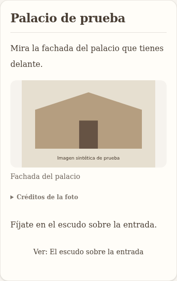

# Imágenes contextuales del tour

Fecha: 2026-09-06. Estado: implementación técnica y pruebas completadas;
activación del modelo y calibración editorial real pendientes.

## Objetivo y experiencia acordada

Ayudar a reconocer lo mencionado en el relato sin llenar la pantalla del móvil.
Máximo una foto principal visible y un detalle opcional por parada. No hay cuota mínima.
La principal aparece tras el párrafo que presenta el objeto; el detalle se abre desde
un control «Ver …» junto al párrafo correspondiente. Ambas se pueden ampliar y tienen
créditos accesibles. Sin carrusel, duplicados ni fotos decorativas.

## Decisiones de implementación

1. Añadir un enriquecimiento después de obtener el relato final, antes de guardar el tour,
   en MultilingualTourGenerator. No cambiar el texto, auditoría ni publicación existentes.
2. Un analizador identifica hasta dos referencias útiles en párrafos del texto. Solo admite
   el lugar identificado por el QID existente; referencias a otros objetos ambiguos se omiten.
   El detalle debe pertenecer al mismo objeto y estar mencionado expresamente.
3. Obtener un conjunto pequeño de candidatos de Commons vinculados al QID (imagen P18 o
   declaración depicts P180). La búsqueda por palabras sola no autoriza una fotografía.
4. Comprobar derechos antes de enviar candidatos a la revisión visual. Admitir CC0, CC BY y
   CC BY-SA con versión reconocida, autor y enlace verificable. Dominio público u otras
   licencias con fundamento ambiguo quedan para revisión posterior. Omitir restricciones
   adicionales señaladas en la ficha. No afirmar garantía jurídica universal.
5. Un modelo visual comprueba visibilidad, objeto y correspondencia con el párrafo. Una
   respuesta dudosa, mal formada o negativa no publica nada. Su opinión no sustituye la
   identidad documental ni los metadatos de licencia. No usar reconstrucciones ni imágenes
   históricas para orientar sobre el aspecto actual.
6. Guardar en metadata de cada parada el conjunto seleccionado, anclas de párrafo,
   texto de origen, evidencia de identidad, fuente, autor, licencia, fecha y motivo visual.
   Usar la persistencia JSON existente; sin migración de base de datos. El frontend solo
   muestra imágenes del conjunto validado cuyo texto de origen sigue coincidiendo.
7. Separar obtención de candidatos de selección contextual. Conservar el servicio antiguo
   para sus consumidores actuales; el flujo nuevo no acepta su URL desnuda como validada.
   PlaceCard deja de publicar fotos antiguas sin atribución verificable; no se borra su dato.
8. Límites explícitos de candidatos, llamadas y tiempo; cancelación propagada y errores de
   fotos no impiden conservar el tour. Configuración explícita del modelo visual compatible
   con chat completions. Sin configuración se registra que las imágenes no están disponibles.
   No ocultar este requisito en el informe final. No iniciar una generación completa de pago
   para validar esta función.

## Fases y aceptación

- [x] Contrato de imágenes, proveedor Commons y política de derechos con pruebas negativas.
- [x] Análisis de referencias y verificación visual, con límites, cancelación y pruebas.
- [x] Integración en generación y conservación mediante metadata/API.
- [x] Presentación móvil: principal compacta, detalle cerrado, ampliación, créditos y errores.
- [x] Validación de tipos, pruebas enfocadas e inspección móvil con datos controlados.
- [x] Actualizar este documento con resultados y limitaciones reales.
- [ ] Configurar modelo visual y ejecutar/revisar la muestra con fotografías reales.

## Validación editorial previa a producción

La automatización no equivale a una calibración editorial. Preparar una muestra reproducible
de 30–50 fragmentos reales con candidatos y resultado; revisar identidad, utilidad visual,
licencia y omisiones. Incluir homónimos, detalles, interiores, fotos históricas y ausencia de
imágenes. Registrar cobertura, errores, tiempo y consumo. No declarar esa revisión completada
si solo se han ejecutado pruebas simuladas. La primera entrega debe permitir esa evaluación.

## Fuentes de la política

- https://commons.wikimedia.org/wiki/Commons:Reusing_content_outside_Wikimedia/en
- https://commons.wikimedia.org/wiki/Commons:Structured_data/Modeling/Depiction
- https://creativecommons.org/licenses/by-sa/4.0/

## Resultado de ejecución

### Entrega implementada

La generación multilingüe llama al enriquecimiento antes de guardar el borrador. El JSON
de metadata ya se conserva en Postgres y en la respuesta de consulta; no se modifica el
esquema ni se necesita migración. Una parada solo puede publicar una principal y un detalle
de otro archivo. Cada asociación guarda el párrafo exacto y su identificador/hash, además
del texto de origen. Cambiar ese texto invalida la presentación del conjunto.

El proveedor nuevo consulta P18 y P180, comprueba declaraciones no obsoletas de identidad,
admite exclusivamente los formatos/licencias establecidos y devuelve datos de atribución.
No se llama a la búsqueda antigua por palabras para aceptar automáticamente una imagen.
El servicio antiguo se conserva para sus otros consumidores; no se ha eliminado ni
reconectado al formulario. No hay actualización masiva de tours ya guardados ni de tours
antiguos reutilizados desde caché.

La interfaz conserva las proporciones completas de la foto (sin recortarla), muestra una
principal de 176 px de alto en móvil y abre el detalle únicamente al pulsarlo. El detalle
no se descarga antes de abrirlo. La ampliación usa un diálogo con cierre, Escape, foco
contenido y restauración del foco/desplazamiento. Los controles están traducidos a los
cinco idiomas de la aplicación. Un fallo de imagen no bloquea el relato.

### Validación ejecutada

- Tipos de backend y frontend: correctos con Node 22.14.0.
- 61 pruebas en seis suites: candidatos/licencias, selección contextual, transporte visual,
  límites/cancelación del enriquecimiento, integración multilingüe y persistencia JSON.
- Lint de los componentes y tipos nuevos del frontend: correcto.
- Prueba de navegador contra la página real, a 390 × 844: correcta. Comprueba máximo de
  fotos, detalle en otro párrafo, descarga diferida, créditos, cierre con botón/Escape,
  foco, ausencia de desbordamiento horizontal, texto cambiado y archivo roto.
- Diff de las modificaciones propias sin errores de espacios. Los cambios previos y
  concurrentes de otros trabajos se conservan. No se ha hecho commit, push ni despliegue.

La captura usa una imagen sintética de prueba, no una fotografía aprobada:



### Configuración y límite de esta entrega

`backend/.env.example` documenta `TOUR_IMAGES_MODEL`, `TOUR_IMAGES_API_KEY`,
`TOUR_IMAGES_BASE_URL` y `WIKIMEDIA_USER_AGENT`. El modelo debe aceptar imágenes y
respuestas JSON en una API compatible con chat completions. No se ha elegido ni
configurado un modelo de pago: las variables específicas no estaban en el entorno local.
Sin modelo/clave el servicio guarda `disabled / model-not-configured`; no inventa fotos.

Límites: hasta 12 paradas, 4 candidatos por parada, 2 llamadas al modelo por parada,
1.800 tokens máximos de salida por llamada, 60 segundos por parada y 180 segundos por tour.
El consumo de imágenes es separado del presupuesto USD de narración ya existente:
estos límites no equivalen a un tope monetario. Antes de activarlo, configurar también el
límite de gasto en el proveedor y medir el consumo del modelo elegido.

La licencia se comprueba por archivo, pero la comprobación automática no garantiza por sí
sola la situación de los derechos sobre todas las obras fotografiadas. Casos señalados como
restringidos se omiten; casos jurídicos ambiguos requieren revisión. Dominio público y
variantes de licencia fuera de la lista inicial se omiten conservadoramente.

La primera versión resuelve el objeto de la parada mediante su QID conocido. No resuelve
automáticamente otro edificio mencionado dentro del relato de una plaza. Ese caso se
omite antes que asociarlo a la identidad equivocada. Ampliar entidades requiere una fase
posterior de resolución documental. La evaluación visual real aún no está calibrada;
los tests usan respuestas controladas y no demuestran precisión editorial en producción.

### Piloto reproducible

Se preparó [una muestra de 40 párrafos reales](70-contextual-images-pilot-sample.json) del
fixture de Madrid, con espacio para revisar identidad, utilidad y derechos. Su estado es
`sample-only`: no se han buscado ni revisado fotos para esa muestra. Otros idiomas,
homónimos e interiores deben añadirse antes de dar por terminada la calibración.

Desde `backend`, con Node 22 y las variables configuradas, el comando siguiente procesa
solo las imágenes del tour guardado; no regenera narración ni escribe en la base de datos.
La opción `--live` realiza llamadas al proveedor; sin ella solo prepara la muestra.
El archivo de salida debe ser nuevo.

```sh
node node_modules/tsx/dist/cli.mjs scripts/validation/contextual-images-pilot.ts \
  --input fixtures/tours/madrid-history-es-candidate.json \
  --output /tmp/contextual-images-live-review.json --live
```

La prueba visual reutilizable es `scripts/tour-images-smoke.cjs`. Requiere Next en el
puerto 3107 (o `SMOKE_BASE_URL`) y Playwright. Puede indicarse `PLAYWRIGHT_MODULE` para
una instalación externa y `PLAYWRIGHT_CHROMIUM_PATH` para un navegador instalado.
No se han añadido dependencias ni modificado lockfiles para esta prueba.

### Inventario propio para coordinación de commits

Existentes modificados: `backend/.env.example`, `backend/src/domain/entities/Place.ts`,
`backend/src/services/MultilingualTourGenerator.ts` y su test (solo integración de imágenes),
`frontend/src/types/api.ts` (solo metadata de imágenes), `frontend/src/components/tour/PlaceCard.tsx`.

Nuevos: `backend/src/domain/entities/TourImage.ts`; servicios `CommonsImageCandidates`,
`ContextualTourImages`, `TourImageModel`, `enrichTourImages` y sus cuatro tests;
`TourImagesPersistence.test.ts`; `backend/scripts/validation/contextual-images-pilot.ts`;
`frontend/src/types/tourImages.ts`; `frontend/src/components/tour/TourPhoto.tsx`;
`scripts/tour-images-smoke.cjs`; este documento, su muestra JSON y su captura PNG.
