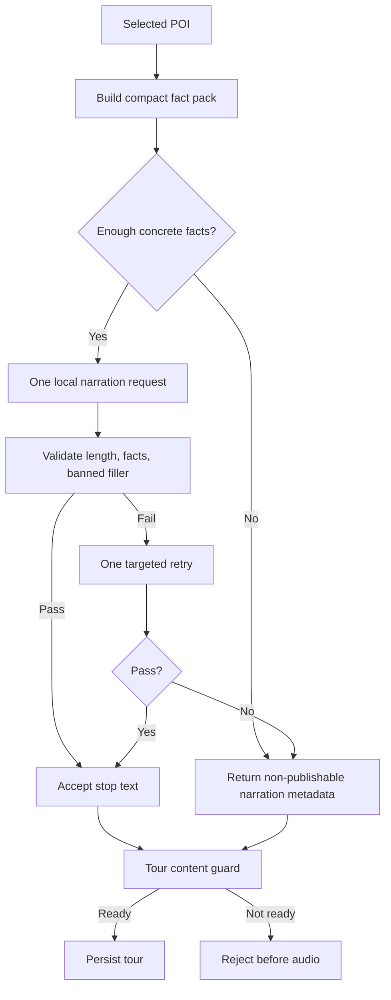

# Fast Local Narration Plan

## Decision

Use `qwen2.5:14b` as the default local narrative model for paid tour narration.

Why:

- It is already installed locally.
- It fits the current RTX 5080 16 GB setup better than `gemma4:26b`.
- Short local tests produced concrete stop narration faster and more reliably.
- The main failure mode is not lack of model size; it is weak source facts plus fallback-like editorial filler.

## Goal

Generate publishable stop text before audio with the smallest reliable change:

1. Build narration from a compact fact pack.
2. Make one main LLM call per stop instead of many section calls.
3. Reject generic filler even when it is long enough.
4. Retry at most once.
5. If the stop is still weak, block the tour before persistence/audio.

## Non-Goals

- No new external provider.
- No large model download by default.
- No DeepSeek reviewer in the first pass.
- No full rewrite of route selection, enrichment, images, or TTS.

## Flow

## Acceptance Criteria

- Default narrative model is no longer `gemma4:26b`.
- Stop narration uses a single fast endpoint by default.
- Text containing generic filler such as `urban fabric`, `transition point`, `formal boundary`, or `relationship with the immediate surroundings` is rejected.
- Stops with fallback or weak narration metadata make the tour fail before persistence.
- Existing focused backend tests pass.
