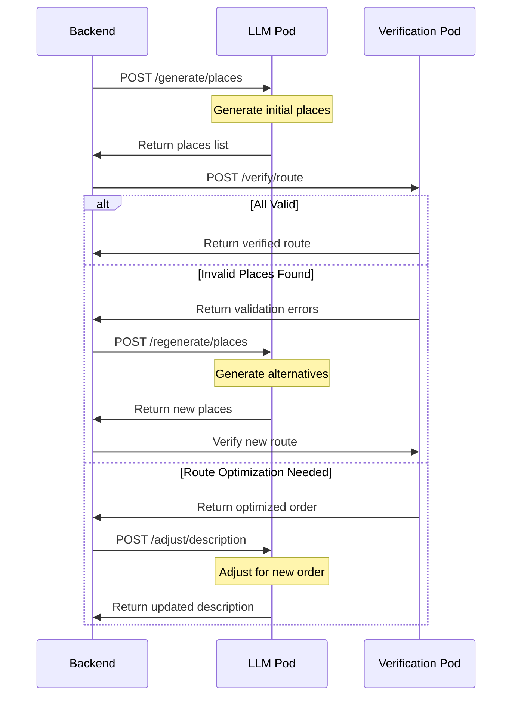

# Verification Pod

Service for validating tour data and route feasibility.

## Overview

The verification pod ensures that generated tours are:
1. Based on real locations
2. Have reasonable walking distances
3. Can be completed in the specified time

## Implementation Phases

### Phase 1: Basic Place Verification ✅
Verify individual places and their coordinates exist.

#### Completed Features
- Validate coordinates exist in specified city
- Verify place is publicly accessible
- OpenStreetMap integration
- Place categorization (tourist, historical, cultural, etc.)
- Confidence scoring system
- Enhanced accessibility checking
- Improved error handling

#### API Endpoint
```typescript
POST /verify/place
Request:
{
  name: string;
  coordinates: {
    lat: number;
    lng: number;
  };
  city: string;
  country: string;       // Added for city disambiguation
  countryCode: string;   // ISO 3166-1 alpha-2 code
}

Response:
{
  valid: boolean;
  exists: boolean;
  inCity: boolean;
  details: {
    osmId: string;
    type: string;
    confidence: number;     // 0-1 score based on available data
    category: PlaceCategory;
    accessibility: PlaceAccessibility;
  }
}

// Place Categories
type PlaceCategory = 
  | 'tourist'      // Major tourist attractions
  | 'historical'   // Historical sites
  | 'cultural'     // Museums, theaters
  | 'religious'    // Churches, temples
  | 'natural'      // Parks, gardens
  | 'other';       // Other POIs

type PlaceAccessibility = 
  | 'public'       // Always accessible
  | 'limited'      // Limited hours/seasonal
  | 'private'      // Private property
  | 'unknown';     // Unknown accessibility
```

### Phase 2: Route Validation ✅
Calculate and validate walking routes between places.

#### Current Implementation
- Distance calculations between stops using Haversine formula
- Total walking time estimation based on 4 km/h speed
- Maximum distance validation (1km between stops)
- Stop duration estimates (7-10 minutes per stop)
- Route compactness validation
- Comprehensive error reporting

#### New Features ✅
- Stop importance validation:
  * Weighted scoring based on OSM tags
  * Tourism and historic tag combination detection
  * Wikipedia/Wikidata presence checking
- Duplicate stop detection:
  * Physical proximity check (<100m)
  * Name similarity analysis
  * OSM tag relationship check
- Order optimization:
  * Nearest neighbor algorithm for stop ordering
  * Distance-based improvements
  * Walking time optimization

#### API Endpoint
```typescript
POST /verify/route
Request:
{
  stops: Array<{
    lat: number;
    lng: number;
    name: string;
  }>;
  city: string;
  country: string;       // Added for city disambiguation
  countryCode: string;   // ISO 3166-1 alpha-2 code
  duration: number;      // desired tour duration in minutes
}

Response:
{
  valid: boolean;
  totalWalkingDistance: number;  // meters
  totalWalkingTime: number;      // minutes
  numStops: number;
  details: {
    stopDistances: number[];     // distances between consecutive stops
    averageDistance: number;
    stopDurations: number[];     // estimated time at each stop
    stops: Array<{
      original: RouteStop;
      importance: {
        score: number;          // 0-1 based on tags
        osmTags: string[];      // Relevant tags found
        isTouristAttraction: boolean;
        isHistorical: boolean;
        hasWikiInfo: boolean;
      };
      duplicateOf?: string;     // Name of duplicate if found
    }>;
    optimizedOrder?: RouteStop[];  // Suggested better order if found
    validationErrors?: Array<{
      type: 'DISTANCE' | 'DURATION' | 'DUPLICATE' | 'LOW_IMPORTANCE';
      message: string;
      stopIndexes?: number[];    // affected stops
    }>;
  }
}
```

### Phase 3: Integration with LLM Pod ⏳

#### Flow Diagram


## Validation Rules

### Place Validation
- Must have valid coordinates
- Must be within city boundaries (using country for disambiguation)
- Must be publicly accessible
- Should have sufficient confidence score (>0.6)
- Should be properly categorized
- No duplicate stops

### Route Validation
- Maximum 1km between consecutive stops
- Total walking time should be ~50% of tour duration
- Average 7-10 minutes per stop
- Total duration must fit within requested time

### Stop Importance
- Base scores from OSM tags:
  * tourism=attraction: 0.7
  * historic=monument: 0.7
  * historic=castle: 0.8
- Bonus multipliers:
  * Has Wikipedia info: 1.2x
  * Has Wikidata: 1.1x
  * Multiple categories: 1.3x

## Development Process

1. ✅ Basic setup and OSM integration 
2. ✅ Place verification endpoints
3. ✅ Enhanced place categorization
4. ✅ Place accessibility validation
5. ✅ Route calculation implementation
6. ✅ Stop importance scoring
7. ✅ Duplicate detection
8. ✅ Route optimization
9. ⏳ Integration testing with LLM Pod

## Local Development

```bash
# Install dependencies
npm install

# Start in development mode
npm run dev

# Run tests
npm test

# Build for production
npm run build
```

## Environment Variables

```env
PORT=3003
NODE_ENV=development
OPENSTREETMAP_API_URL=https://nominatim.openstreetmap.org
RATE_LIMIT_WINDOW_MS=900000
RATE_LIMIT_MAX_REQUESTS=100
